# Room segmentation algorithm — detailed description

This document walks through the pipeline step by step: what each stage does, why
it is built that way, what its parameters are and where it lives in the code. A
short overview is in [README.md](README.md); this is the same thing with the
implementation details.

A worked example on one concrete image, with a picture after every single
operation, is in [EXAMPLE.md](EXAMPLE.md). The exploration notebook with
measurements and rejected ideas is [`segmentation.ipynb`](segmentation.ipynb).

---

## Contents

1. [The problem and the key idea](#1-the-problem-and-the-key-idea)
2. [Overall flow](#2-overall-flow)
3. [Step 1. Separating the plan from the background](#step-1-separating-the-plan-from-the-background)
4. [Step 2. Wall colour for this particular image](#step-2-wall-colour-for-this-particular-image)
5. [Step 3. Wall mask and barrier](#step-3-wall-mask-and-barrier)
6. [Step 4. Distance map — the "terrain"](#step-4-distance-map--the-terrain)
7. [Step 5. Markers via h-maxima](#step-5-markers-via-h-maxima)
8. [Step 6. Watershed](#step-6-watershed)
9. [Step 7. Merging by boundary width](#step-7-merging-by-boundary-width)
10. [Step 8. Absorbing small regions](#step-8-absorbing-small-regions)
11. [Step 9. Polygons, areas, JSON](#step-9-polygons-areas-json)
12. [Step 10. The semantic layer (`--semantics`)](#step-10-the-semantic-layer---semantics)
13. [Parameter reference](#parameter-reference)
14. [Performance](#performance)
15. [What was tried and rejected](#what-was-tried-and-rejected)
16. [Limitations](#limitations)
17. [Code map](#code-map)

---

## 1. The problem and the key idea

**Input:** one image — a 3D render of an apartment floor plan (the kind of
marketing picture found on a property website), viewed almost straight from
above, with extruded walls and furniture inside.

**Output:** a list of rooms, each with a boundary polygon in pixels and a
relative area.

Why an off-the-shelf solution does not apply: the standard floor-plan models
(CubiCasa5K, DeepFloorplan and relatives) are trained on **2D drawings**, where a
wall is a thin line on a white background. Here we have a photorealistic render
with shadows, textures and furniture, and the transfer does not work.

**The key idea:** a room is *floor enclosed by walls*. Walls in the render have a
characteristic colour (bright, low saturation), so they can be found by colour,
and everything else inside the plan is floor that has to be divided into rooms.

### The feature that shapes the whole design

The render is three-dimensional, so a wall has **two visible faces**:

- the **top** face — bright, lit, and this is the one that carries the "wall
  colour";
- the **side** face — in shadow, does not look like a wall by colour, but still
  physically blocks the room.

Hence the split into two entities: `wall` (found by colour) and `barrier`
(`wall` dilated by a few pixels so that the side face is covered too). Rooms are
built in the space of "plan minus barrier".

### Assumptions

| Assumption | Check on the sample |
|---|---|
| Top-down, near-orthographic view | dominant line directions within ±6° of 0°/90°, no rectification needed |
| The page background is white and simply connected | holds on all three |
| The outer contour of the plan is a wall | holds on all three; step 2 depends on it |
| Walls are distinguishable from the floor by colour | distance ≳ 18 in OpenCV 8-bit Lab (≈ 7 L\* units); the third render is borderline |
| Occlusion is limited | a wall hides a strip of floor on its shaded side — not compensated |

---

## 2. Overall flow

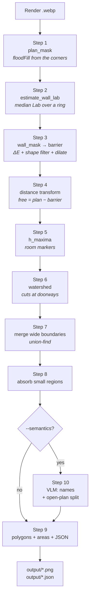

Steps 1–9 need neither a network connection nor model weights. Step 10 is
optional.

---

## Step 1. Separating the plan from the background

**Code:** `floorplan_seg/preprocess.py:62-97`, helper `_fill_interior_holes` on
lines 48-59.

**Input:** a BGR image. **Output:** a boolean `plan` mask.

### What gets in the way

The picture holds more than the plan: on two of the three renders a disclaimer is
printed at the bottom in small type ("Renderings are an artist's conception…").
Left alone, it enters the processing as a separate "island".

### How it works

**1.1. Flood-filling the background from the corners.** The image corners are
guaranteed to be white — the plan physically cannot occupy them. We run
`cv.floodFill` from all four corners:

```python
ff = np.zeros((h + 2, w + 2), np.uint8)   # floodFill wants a mask 2 px larger
for seed in ((0, 0), (w - 1, 0), (0, h - 1), (w - 1, h - 1)):
    cv.floodFill(scratch, ff, seed, 0,
                 loDiff=BG_FLOOD_TOL, upDiff=BG_FLOOD_TOL,
                 flags=4 | cv.FLOODFILL_FIXED_RANGE)
```

Two non-obvious points:

- **`FLOODFILL_FIXED_RANGE`** — compare each pixel against the seed colour rather
  than against its neighbour. Without this flag the fill creeps deep into the
  plan along a soft shadow gradient: every next pixel differs from the previous
  one by less than the tolerance, and the fill front spreads out of control.
- **the 2-pixel-larger mask** is an OpenCV requirement; it is cropped afterwards
  with `ff[1:-1, 1:-1]`.

**1.2. Closing the pinholes.** `MORPH_CLOSE` with a 9×9 kernel patches the holes
along the object boundary produced by antialiasing.

**1.3. The largest component.** `connectedComponentsWithStats` splits the
"non-background" into islands; we take the one with the largest area. The
disclaimer drops out by itself, because it is smaller than the plan and not
connected to it.

```python
largest = 1 + int(np.argmax(stats[1:, cv.CC_STAT_AREA]))  # stats[0] is the background
```

**1.4. Filling interior pockets.** White areas may remain inside the plan.
Telling a hole from real background is easy: **real background touches the image
border, a hole does not.**

```python
border = np.concatenate([comp2[0, :], comp2[-1, :], comp2[:, 0], comp2[:, -1]])
outside = set(np.unique(border).tolist())
for k in range(1, n2):
    if k not in outside:       # never touches the border → a hole inside the plan
        plan |= comp2 == k
```

> **Why not something simpler.** Originally the holes were filled with a
> `floodFill` from point (0, 0) on the inverted mask. That breaks when the plan
> comes right up to the corner of the frame: point (0, 0) ends up inside the
> plan, the fill never starts, and everything gets declared a "hole". On the
> third render (`highlandlux`) the plan covers 75 % of the frame and almost
> touches the edges — which is exactly where the bug showed up.

### Result

| Input | Plan mask |
|---|---|
| 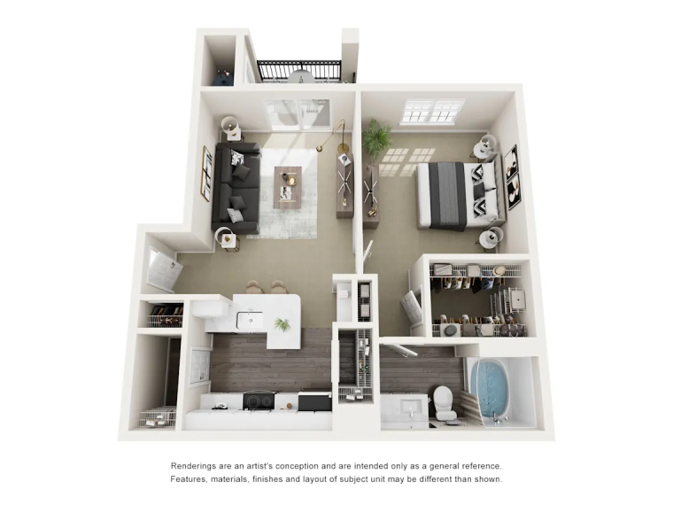 | 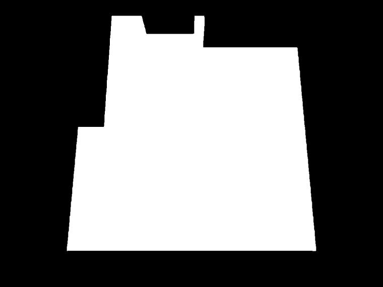 |

Fraction of the frame occupied by the plan: 43.6 % / 75.0 % / 42.8 % across the
three renders.

---

## Step 2. Wall colour for this particular image

**Code:** `floorplan_seg/preprocess.py:100-136`.

**Input:** the image and `plan`. **Output:** a vector of three numbers — the
median wall colour in CIELAB.

### Why this deserves its own step

This is the most important decision in the whole pipeline. Different render
providers use different palettes, and a fixed "a wall is very bright" threshold
does not transfer:

| Render | Lab L of the wall | Wall fraction, adaptive | Wall fraction, fixed threshold |
|---|---|---|---|
| heritage towers | 219 | 25 % | 14 % |
| highlandlux | 235 | 31 % | 33 % |
| limestone ranch | 239 | 24 % | 29 % |

A fixed threshold of `S < 25 and V > 215` swings between 14 % and 33 %, the
adaptive estimate stays within 24–31 %. On `heritage towers` the fixed threshold
loses almost half of the walls.

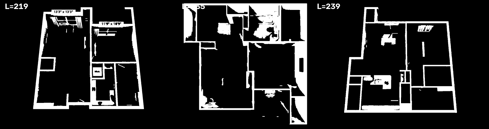

*Three renders, the same code parameters, different underlying wall colour
(L = 219, 235, 239). The skeleton reads on all three.*

### How it works

The anchoring observation: **the outer contour of a plan is always an exterior
wall.** So the colour sample can be taken from there without knowing anything
about the palette in advance.

We build a thin ring along the contour as the difference of two erosions:

```python
inner  = cv.erode(pm, k, iterations=WALL_RING_INNER)   # shrink by 2 px
deeper = cv.erode(pm, k, iterations=WALL_RING_OUTER)   # shrink by 9 px
ring = inner & ~deeper                                 # a 7 px wide strip
```

The 2-pixel offset from the very edge keeps the semi-transparent antialiased
pixels on the border with the background out of the sample.

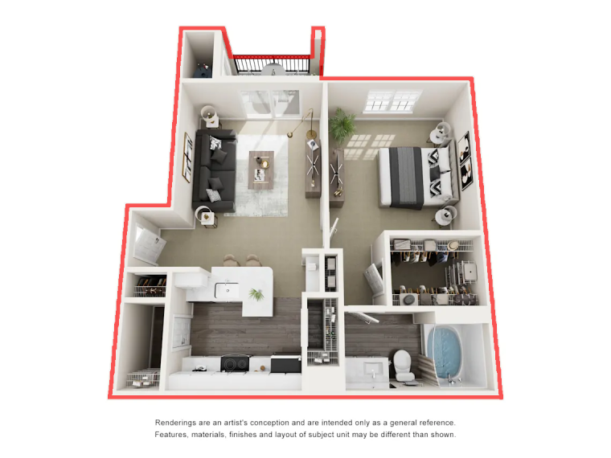

Then two choices, each for its own reason:

- **CIELAB rather than RGB or HSV.** Lab is designed so that the Euclidean
  distance between two colours is roughly proportional to the perceived
  difference. In RGB a distance of 20 means very different things in the dark and
  in the bright part of the range, and a single threshold across the image works
  badly.
- **Median rather than mean.** The ring inevitably catches pieces of furniture
  standing against the exterior wall, plants on the balcony, window frames. The
  median is robust to such outliers, the mean is not.

The ring contains on the order of 17,000–21,000 pixels, which is plenty.

---

## Step 3. Wall mask and barrier

**Code:** `floorplan_seg/preprocess.py:162-206`, shape filter
`_drop_compact_blobs` on lines 139-159.

**Input:** the image, `plan`, the wall colour. **Output:** `wall` and `barrier`.

### 3.1. Colour threshold

For every pixel, the Euclidean distance to the wall colour in Lab (the "delta E"
below — with a caveat on units after the code):

```python
delta = np.linalg.norm(lab - wall_lab, axis=2)
raw = plan & (delta < WALL_DELTA_E)          # threshold 18
raw = cv.morphologyEx(raw, cv.MORPH_OPEN, np.ones((3, 3)))
```

> **Units.** The image is converted with `cv.COLOR_BGR2LAB` on 8-bit data, so
> `L` is scaled to 0–255 (×2.55 against CIELAB L\*) and `a`, `b` are offset by
> 128. The threshold of 18 is therefore a distance in that encoding, not a CIE
> ΔE\*ab: along `L` it corresponds to about 7 L\* units, along `a`/`b` to 18.
> (This is also why the swatch in EXAMPLE.md reads `Lab = [219, 127, 129]`.)

Morphological opening (erosion followed by dilation) removes isolated speckle and
thin spurious bridges without touching the large structures.

### 3.2. Rejecting white furniture — by shape, not by colour

The problem: a white bathtub, a toilet, a sink, a kitchen run, wall tiling are all
the same colour as the walls and cannot be separated by colour at all.

The difference is **topological**: the wall network of a flat is one large
connected structure, while sanitary ware and furniture are separate compact
blobs. The rule:

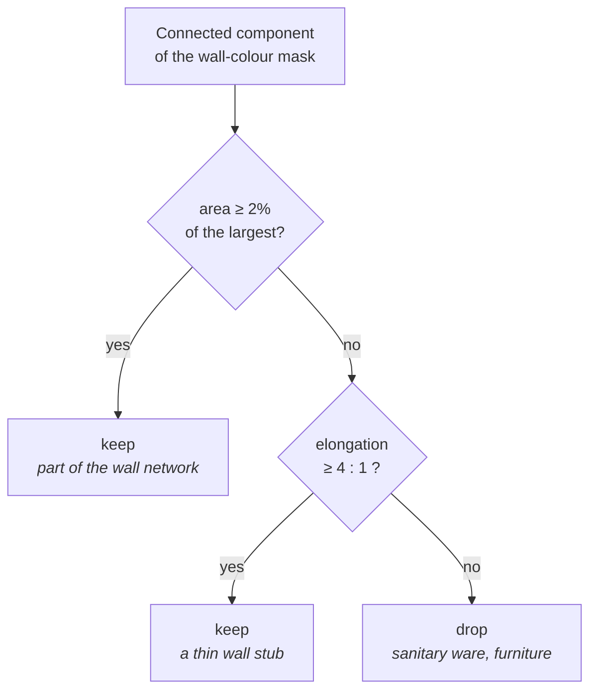

Elongation is measured with the minimum **rotated** rectangle (`cv.minAreaRect`),
not with an axis-aligned bounding box: a diagonal wall looks square in a bounding
box and would be dropped by mistake.

In practice 31–82 blobs are dropped per image.

### 3.3. The barrier

The found walls are dilated with a square kernel of side `WALL_DILATE` so that
the shaded side face is covered. The default 3×3 kernel adds **one pixel on each
side** of the wall (the parameter is a kernel size, not a radius); 0 or 1
disables the dilation:

```python
barrier = cv.dilate(wall, np.ones((WALL_DILATE, WALL_DILATE))) & plan
```

| Wall mask (top faces only) | Barrier over the render |
|---|---|
| 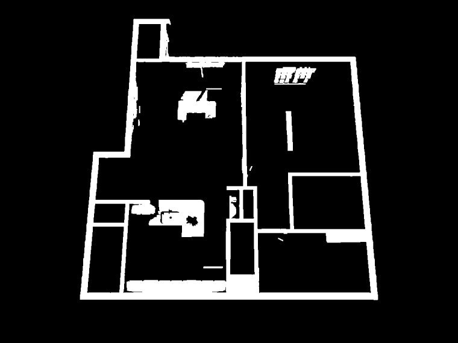 | 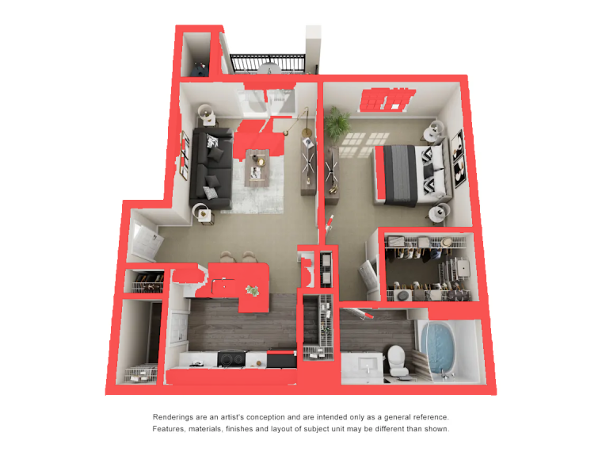 |

This is a trade-off: the barrier eats a few pixels of genuine floor around the
perimeter of every room, which is why areas come out systematically low (see
[Limitations](#limitations)).

---

## Step 4. Distance map — the "terrain"

**Code:** `floorplan_seg/seeds.py:171-177`.

Free space is the plan without the barrier. For each of its pixels we compute the
Euclidean distance to the nearest wall:

```python
free = plan & ~barrier
distance = ndi.distance_transform_edt(free)
smoothed = gaussian(distance, sigma=SMOOTH_SIGMA, preserve_range=True)
```

A useful metaphor is a height map:

- the middle of a large room is a **tall hill** (the walls are far away);
- a corner is a lowland;
- **a doorway is a mountain pass**: the lowest point on the path between two
  hills.

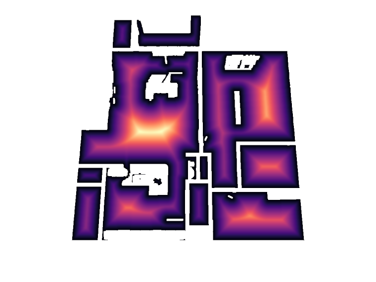

*Bright means far from the walls. The "peaks" in the middles of rooms and the
narrow necks between them are clearly visible.*

**Why the blur.** Furniture outlines put ripples of 1–3 pixels on the distance
map. Without smoothing every such ripple becomes a separate marker on the next
step, that is, a separate "room". A Gaussian with σ = 2 removes them while barely
shifting the genuine peaks.

The deepest point across the three renders: 117, 103 and 98 pixels from the
nearest wall.

---

## Step 5. Markers via h-maxima

**Code:** `floorplan_seg/seeds.py:179-191`.

The watershed has to start somewhere — one seed point per room.

### Why not local maxima

The first version used `skimage.feature.peak_local_max`. The result:
**30 / 27 / 28 regions** across the three images against the real ~7 / 7 / 10.
The reason: on the plateau around a genuine peak there are many pixels with the
same local maximum, plus every piece of furniture forms its own little peak.

### h-maxima

The h-maxima transform keeps only those maxima that rise **at least `h`** above
the surrounding basin. Formally, it suppresses all connected maxima whose dynamic
range is below `h`.

```python
peaks = h_maxima(smoothed * free, H_MAXIMA) * free    # h = 10
markers, n_markers = ndi.label(peaks)
```

The parameter has a physical meaning: a "hill" counts as a room only if its
centre is 10 pixels further from the walls than the nearest saddle. The ripples
from furniture are cut off.

The result: **12 / 12 / 13 markers** instead of 30 / 27 / 28.

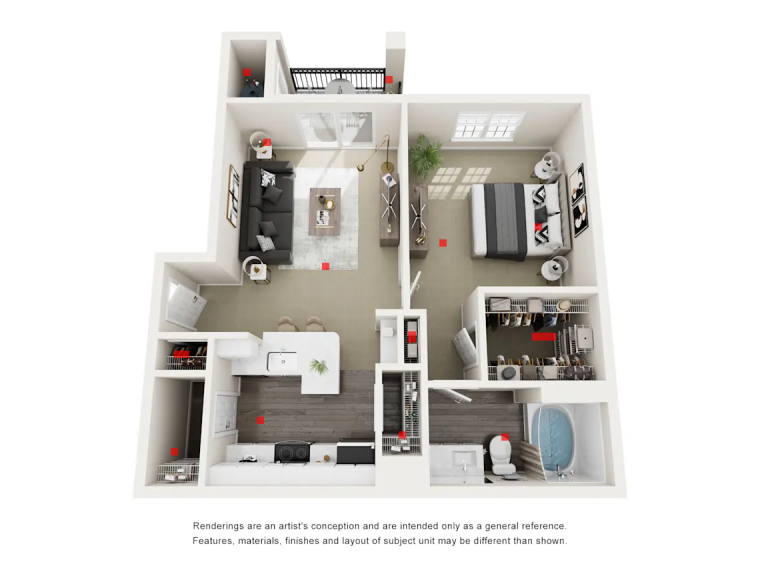

*The markers are tiny (a few pixels), dilated here for display.*

`ndi.label` numbers the surviving plateaus 1, 2, 3, … If no markers are found at
all (a degenerate input), the whole free space is declared one room.

---

## Step 6. Watershed

**Code:** `floorplan_seg/seeds.py:193`.

```python
labels = watershed(-smoothed, markers, mask=free)
```

The terrain is inverted (`-smoothed`): hilltops become basins. Water is poured
from every marker simultaneously. It fills the free space and stops where it
meets the water of a neighbour — **exactly at the pass, that is, in the doorway**.
The `mask=free` argument keeps it off the walls.

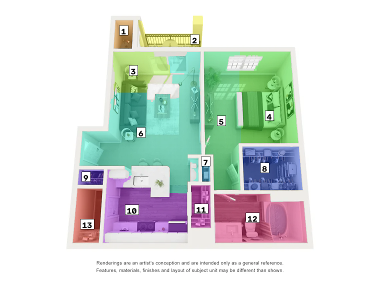

*13 regions. The boundaries between rooms are already correct, but some rooms
have been cut one time too many.*

---

## Step 7. Merging by boundary width

**Code:** `floorplan_seg/seeds.py:89-103`, adjacency in `_adjacency` (lines
54-78), union-find in `_DisjointSet` (lines 35-51).

### The problem

The watershed cuts at **any** constriction, not only at doors. A living room that
merely narrows in the middle will be cut in half with no wall involved.

### The criterion

We look at the **widest point of the shared boundary** between two regions, that
is, the maximum of the distance map along their contact:

- at a genuine doorway the contact is narrow — the walls are close on all sides;
- at a false cut across an open space the contact is wide.

```
if max(distance) along the contact > PASSAGE_MERGE_WIDTH (16 px) → not a door → merge
```

### How adjacency is computed

Vectorised, with no per-pixel loops: the label map is shifted by one pixel down
and right and compared against itself.

```python
for dy, dx in ((1, 0), (0, 1)):
    a = labels[: H - dy, : W - dx]
    b = labels[dy:, dx:]
    d = distance[dy:, dx:]
    touching = (a > 0) & (b > 0) & (a != b)      # two different regions touch here
    lo = np.minimum(a[touching], b[touching])    # normalise the pair so that
    hi = np.maximum(a[touching], b[touching])    # (2,5) and (5,2) share one key
```

It returns a dictionary `{(a, b): (how many pixels touch, contact width)}`. The
first number is used in step 8, the second one here.

### Why union-find

Merges are transitive: if A is merged with B and B with C, all three are one
room. The naive "merge pairs in a loop and restart" approach works but is
quadratic and confusing about identifiers. Union-find (a disjoint-set structure)
does it in almost linear time:

```python
def find(x):
    while parent[x] != x:
        parent[x] = parent[parent[x]]   # path compression along the way
        x = parent[x]
    return x
```

The new identifier of a group is always the smallest of the ones being merged
(`parent[max(ra, rb)] = min(ra, rb)`), which keeps the result deterministic.

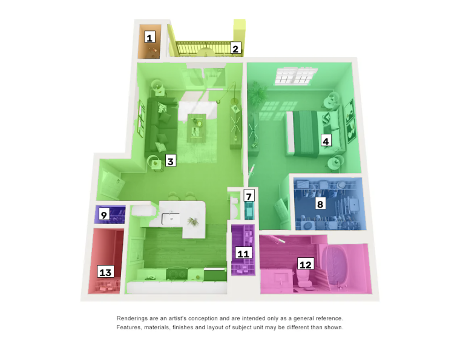

*13 became 10. Merges: 1 / 2 / 3 across the three renders.*

---

## Step 8. Absorbing small regions

**Code:** `floorplan_seg/seeds.py:115-145`, nearest-region lookup in
`_nearest_label` (lines 106-112), renumbering on lines 81-86.

After merging, tiny offcuts remain — fractions of a percent of the area. In a
loop:

1. find the smallest region;
2. see which neighbour it shares the **longest boundary** with (the first number
   from `_adjacency`);
3. attach it there;
4. repeat until the smallest region is above the threshold.

The threshold is a fraction of the plan area: `0.004 × plan.sum()`, that is,
roughly 1,300–1,700 pixels on these images. An isolated islet with no neighbours
(free space enclosed by barrier on every side) is attached to the nearest
full-sized region by Euclidean distance rather than discarded, so the regions
keep tiling the free space and no area is lost. Full-sized regions are
preferred so that an islet cannot rescue another undersized scrap from
absorption.

The labels are then renumbered consecutively (1, 2, 3, …), because merging leaves
gaps in the numbering.

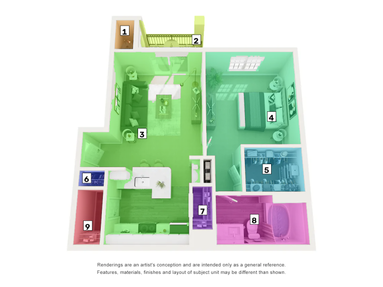

*The result of the geometric stage: 9 regions. The largest one (42 %) is the
single open kitchen-living-entry area, which geometry cannot divide.*

Summary across the three renders:

| Render | Markers | After watershed | After merging | Final |
|---|---|---|---|---|
| heritage towers | 12 | 12 | 11 | 9 |
| highlandlux | 12 | 12 | 10 | 10 |
| limestone ranch | 13 | 13 | 10 | 9 |

---

## Step 9. Polygons, areas, JSON

**Code:** `floorplan_seg/export.py`, areas in `floorplan_seg/pipeline.py:98-120`.

### The polygon

```python
contours, _ = cv.findContours(mask, cv.RETR_EXTERNAL, cv.CHAIN_APPROX_SIMPLE)
contour = max(contours, key=cv.contourArea)
eps = SIMPLIFY * cv.arcLength(contour, closed=True)
contour = cv.approxPolyDP(contour, eps, closed=True)
```

- **`RETR_EXTERNAL`** — the outer contour only. Holes left inside a room by
  furniture and white sanitary ware are ignored on purpose: what is wanted is the
  outline of the *room*, not the outline of the free floor.
- **Douglas–Peucker** (`approxPolyDP`) drops vertices that almost lie on the line
  between their neighbours. The tolerance is given as a fraction of the perimeter
  (0.4 %) rather than in pixels, so the simplification behaves the same on large
  and small rooms. The result: 4–31 vertices instead of hundreds of contour
  points.

### Areas

```
relative_area = room area / total area of all rooms   → sums to exactly 1.0
share_of_plan = room area / area of the whole plan    → less than 1 (walls)
```

If the file name carries an area (`625sq`, `593 Sq. Ft.` — the regex
`(\d{2,5})\s*sq` in `pipeline.py:23`), an estimate in square feet is added by
simple proportion. This is a cheap **sanity check that needs no ground truth**: a
"bedroom" of 4 sq ft means the segmentation broke.

### The JSON format

```jsonc
{
  "image": "limestone ranch_santa fe_625sq.webp",
  "image_size": {"width": 1140, "height": 855},
  "plan_area_px": 416787,
  "rooms_area_px": 305365,
  "advertised_total_sqft": 625.0,
  "units": { ... },
  "rooms": [
    {
      "id": 3,
      "name": null,                  // filled in by step 10
      "area_px": 129628,
      "relative_area": 0.4245,
      "share_of_plan": 0.311,
      "area_sqft_estimate": 265.3,
      "centroid": [445, 423],
      "polygon": [[x, y], ...]       // pixels, origin at the top left
    }
  ]
}
```

### The annotated image

`export.annotated_image` draws the tinted regions, the polygons on top of them (a
white outline of thickness 3 for contrast plus a coloured one of thickness 1) and
a tag with the area share. The tag is placed **at the point of maximum distance
transform inside the region**, not at the centroid: for an L-shaped room the
centroid can fall outside the room.

---

## Step 10. The semantic layer (`--semantics`)

**Code:** `floorplan_seg/semantics.py`. Requires `OPENAI_API_KEY`.

### The task geometry cannot solve

If a kitchen, a dining area and a living room form one space with no walls,
**the boundary physically does not exist**. No distance-based algorithm will find
it. Only someone who understands that a sofa means living room and a hob means
kitchen can draw it. On all three renders this is the single biggest error of the
geometric stage: the largest region takes 31–42 % of the plan.

### Set-of-mark prompting

The model receives **two images**: the clean render and the same render with
tinted regions and numbers on white plates. The task:

1. name every number (a vocabulary of 17 types: living room, kitchen, bedroom,
   bathroom, closet, balcony, mechanical, …);
2. if a region consists of several functional zones, list them with the
   coordinates of a point inside each.

The answer is strictly typed by a pydantic schema and requested through
`client.chat.completions.parse(..., response_format=PlanLabels)` — no free text
to parse, the structure is guaranteed on the API side.

```python
class Zone(BaseModel):
    name: str; x: int; y: int

class RegionLabel(BaseModel):
    id: int; name: str; zones: list[Zone]

class PlanLabels(BaseModel):
    regions: list[RegionLabel]
```

Two implementation details:

- **Legibility of the plates.** The first version drew the numbers in a small
  thin font and the model confused them — it called the balcony a living room.
  After switching to a large font on an opaque white plate the errors stopped.
  This is a case where the styling of a visualisation directly affects accuracy.
- **Coordinate scale.** The image is shrunk to 1280 px on the long side before
  sending; the zone coordinates come back in that scale and are converted back
  (`semantics.py:187-191`).
- **`temperature=0`** — at the default value repeated calls disagreed with each
  other on small regions.

### The open-plan split: geodesic Voronoi

If a region came back with two or more anchor points, we place a marker at each
and run a watershed over a **flat** terrain:

```python
flat = np.zeros(region.shape, np.float32)
sub = watershed(flat, markers, mask=region)
```

With no terrain the watershed degenerates into geodesic Voronoi cells: every
pixel goes to the nearest marker, with the distance measured **inside the
region**, so the cut does not "jump" across protrusions.

If the model missed the region, the point is snapped to its nearest pixel
(`_snap_into_region`, lines 195-206).

> **Why the terrain is flat.** The first attempt drove the cut with the
> brightness gradient, hoping the boundary would follow the change in floor
> finish. It failed: furniture outlines form closed ridges, one basin breaks
> through a gap and floods almost the entire region. Measured on
> `heritage towers`: the zones came out as 730 px and 92,596 px instead of a
> balanced 27,578 and 34,959 with Voronoi.

After the split the rooms are renumbered, so the `id` values are not comparable
with the geometric run.

### Result

| Geometry | After `--semantics` |
|---|---|
|  |  |

The single 42.4 % region (265.3 sq ft) split into `living room` 23.4 % and
`kitchen` 19.1 %, and the rest got names.

**An honest assessment:** this is a demonstration of the approach, not a finished
component. The answers disagree between runs even at `temperature=0` — one run
split it 30.9 / 11.6 %, another 23.4 / 19.1 %, and a 6.8 sq ft niche was called
`dining room` one time and `closet` the next. The cause is the imprecision of the
anchor coordinates the model returns.

---

## Parameter reference

All values live in `floorplan_seg/config.py`; the ones marked with a flag can be
overridden from the CLI without touching the code.

| Parameter | Value | CLI flag | What it does | When to change it |
|---|---|---|---|---|
| `bg_flood_tol` | 6 | — | background fill tolerance | the background is not perfectly white |
| `wall_ring_inner` | 2 | — | ring offset from the edge | — |
| `wall_ring_outer` | 9 | — | outer bound of the ring | — |
| `wall_delta_e` | 18.0 | `--wall-delta-e` | closeness to the wall colour, OpenCV 8-bit Lab units | walls broken → raise; floor eaten → lower |
| `wall_min_component_frac` | 0.02 | — | component area threshold | — |
| `wall_min_elongation` | 4.0 | — | elongation threshold | — |
| `wall_dilate` | 3 | `--wall-dilate` | barrier dilation kernel side (px); 3 = 1 px rim | rooms leaking through door frames → raise |
| `smooth_sigma` | 2.0 | — | blur of the distance map | — |
| `h_maxima` | 10.0 | `--h-maxima` | marker significance | too many rooms → raise; rooms merged → lower |
| `passage_merge_width` | 16.0 | `--merge-width` | doorway width cut-off | open areas fragmented → raise |
| `min_region_area_frac` | 0.004 | `--min-area` | absorption threshold | closets lost → lower |
| `simplify` | 0.004 | `--simplify` | polygon simplification | need a tighter contour → lower |
| `temperature` | 0.0 | — | VLM sampling | — |
| `max_image_side` | 1280 | — | image size for the VLM | — |

---

## Performance

Measured on Apple Silicon, single-threaded, no GPU:

| Render | Size | plan | wall | seeds | Total |
|---|---|---|---|---|---|
| heritage towers | 1140×855 | 3 ms | 92 ms | 191 ms | **290 ms** |
| highlandlux | 659×651 | 1 ms | 12 ms | 99 ms | **115 ms** |
| limestone ranch | 1140×855 | 2 ms | 41 ms | 178 ms | **224 ms** |

Most of the time goes into the merge/absorb step: `_adjacency` is recomputed from
scratch on every iteration of the small-region absorption. That is an obvious
place to optimise, but at 0.2 seconds per image there is no point.

The semantic stage adds 3–5 seconds per image — that is waiting for the API, not
computation.

---

## What was tried and rejected

Three decisions were replaced after measurement, not out of taste.

**1. Local maxima as markers.** `peak_local_max` produced 30 / 27 / 28 regions
against 12 / 12 / 13 with h-maxima. The cause is the plateau around a peak plus
the peaks from furniture.

**2. SAM 2 for extracting rooms.** The hypothesis was that giving
`sam2.1-hiera-large` a point inside a room would return the whole room. Tested on
`heritage towers` with 18 point prompts, all three candidates per prompt:

- the tightest candidate grabs the object under the point (a rug, a bed) — 2–8 %
  of the region area;
- the widest one floods through the walls, taking 37–63 % of the entire plan,
  with 28–48 % of its own area sitting **on top of walls**;
- no candidate matched a room while respecting the walls.

This is expected: SAM is trained on natural photographs, and "a room in an
isometric render" is not an object in its sense. The watershed respects walls by
construction, runs in 0.2 s and needs no 900 MB of weights. SAM 2 was removed
from the pipeline, and with it `torch`, `torchvision` and `transformers` left the
dependencies (~2.5 GB).

**3. Splitting open-plan areas by the brightness gradient.** Described in
[step 10](#the-open-plan-split-geodesic-voronoi): zones of 730 px against
92,596 px.

---

## Limitations

Evaluated on three images without ground-truth masks, so everything below is
observation rather than statistics.

- **Open-plan areas stay a single region.** Without the semantic stage the
  kitchen, dining area and living room are not separated. This is the largest
  error on all three renders.
- **Areas run low by roughly 10 %.** The boundary follows the visible floor
  rather than the wall centreline, and the barrier eats a few more pixels. Check:
  in `heritage towers` the bedroom is printed as `11'9" x 10'9"`, that is
  126 sq ft, and the pipeline reports 112 — an 11 % shortfall.
- **White sanitary ware next to a wall** can join the wall network, pass the
  compactness filter, and bite a piece out of the bathroom or the kitchen.
- **Palette sensitivity.** Low contrast between walls and floor degrades
  everything downstream. The example is `highlandlux`:

  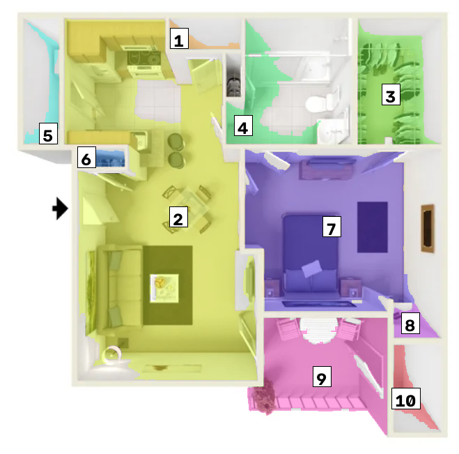

  The regions are found, but the boundaries are visibly dirtier than on the other
  two renders.
- **Room types** are only available through the VLM stage; pure geometry gives
  numbers.
- **Polygons are outer contours**; interior holes (kitchen islands, white
  furniture) are not represented.
- **Strongly oblique isometry** would require rectification, which is not
  implemented here.

---

## Code map

```
floorplan_seg/
  cli.py          argument parsing, writing PNG/JSON, manual-tuning flags
  config.py       every parameter as a dataclass, each with its rationale in the docstring
  preprocess.py   steps 1-3: plan_mask, estimate_wall_lab, wall_mask
  seeds.py        steps 4-8: distance transform, h-maxima, watershed, merging
  export.py       step 9: polygons, relative areas, JSON, annotation
  semantics.py    step 10: VLM labelling and the open-plan split
  pipeline.py     orchestration, the Room and Segmentation dataclasses, sq ft parsing
  viz.py          label-map tinting and tags
```

Which function implements which step:

| Step | Function |
|---|---|
| 1 | `preprocess.plan_mask` |
| 2 | `preprocess.estimate_wall_lab` |
| 3 | `preprocess.wall_mask` (+ `_drop_compact_blobs`) |
| 4–8 | `seeds.region_labels` (+ `_adjacency`, `_merge_open_boundaries`, `_absorb_small_regions`) |
| 9 | `export.room_polygon`, `export.to_record`, `pipeline._build_rooms` |
| 10 | `pipeline.label_rooms` → `semantics.request_labels`, `semantics.apply_labels`, `semantics.split_region_by_zones` |

The entry point that ties it all together: `pipeline.segment_floorplan`
(lines 123-176); the optional naming step is `pipeline.label_rooms`
(lines 179-208), which the CLI calls separately so that a failing semantic
stage cannot discard the geometric result.
