# A worked example: from the picture to the JSON

This document walks through the entire pipeline **on one concrete image**,
showing the result after every operation — not after every stage, but after every
transformation. All the numbers in the text were measured on this exact file.

A description of the algorithm without a specific image is in
[ALGORITHM.md](ALGORITHM.md).

**Source file:** `data/heritage towers_a1_1 Bed 1 Bath 593 Sq. Ft..webp`,
1140 × 855 pixels.

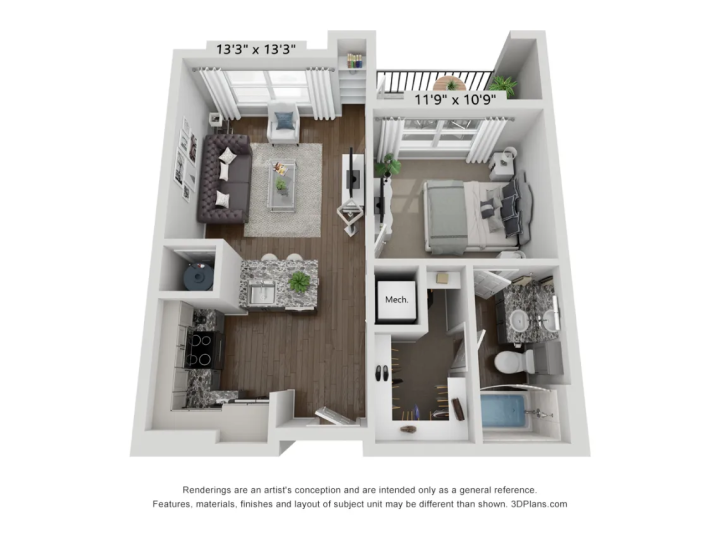

> **Why this plan.** It is the only one of the three that exercises every step:
> the watershed genuinely splits rooms on it, the merge fires, small regions get
> absorbed, and an isolated scrap gets attached to the nearest room. For comparison, on
> `limestone ranch` steps 6–8 together produce the same result as plain
> connectivity of the free space (see
> [the closing summary](#what-this-example-revealed-about-the-algorithm)). A
> bonus: the room dimensions are printed on this plan, which gives an independent
> check on the areas.

---

## Contents

- [Step 1. Separating the plan from the page](#step-1-separating-the-plan-from-the-page) — 4 operations
- [Step 2. Learning the wall colour](#step-2-learning-the-wall-colour) — 2 operations
- [Step 3. Finding the walls](#step-3-finding-the-walls) — 4 operations
- [Step 4. Building the terrain](#step-4-building-the-terrain) — 3 operations
- [Step 5. Placing the markers](#step-5-placing-the-markers)
- [Step 6. Watershed](#step-6-watershed)
- [Step 7. Merging the spurious cuts](#step-7-merging-the-spurious-cuts)
- [Step 8. Clearing the scraps](#step-8-clearing-the-scraps)
- [Step 9. Polygons and areas](#step-9-polygons-and-areas)
- [Step 10. Room names and the open-plan split](#step-10-room-names-and-the-open-plan-split)
- [Checking the result](#checking-the-result)
- [What this example revealed about the algorithm](#what-this-example-revealed-about-the-algorithm)

---

## Step 1. Separating the plan from the page

Goal: obtain a boolean mask where `True` marks the pixels of the apartment plan.
The disclaimer printed at the bottom of the picture is in the way.

### Operation 1.1 — flood-filling the background from the four corners

We run `cv.floodFill` from each corner with a tolerance of 6 grey levels. Yellow
marks what the fill considers background.

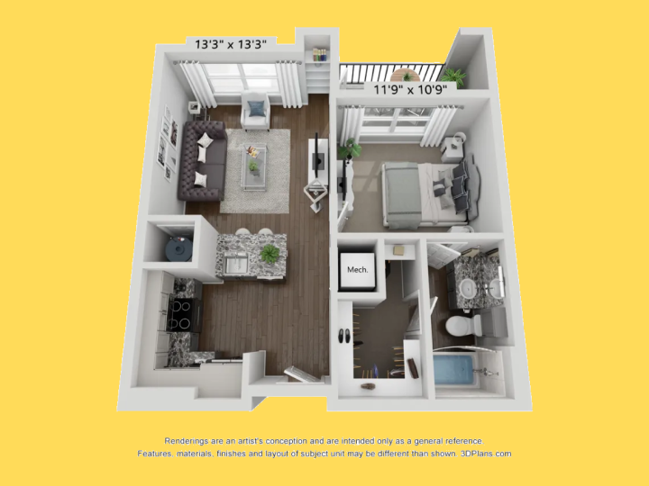

**Result: 55.4 %** of the frame is declared background. Note that the white area
between the disclaimer and the plan is filled too — they are not connected.

### Operation 1.2 — inversion and closing the pinholes

Everything not filled is foreground: **434,353** pixels. Antialiasing leaves
pinholes along the edges of the object, and `MORPH_CLOSE` with a 9×9 kernel
patches them.

| Before closing | After closing |
|---|---|
|  | 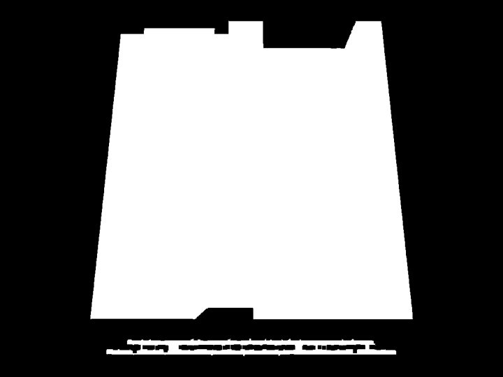 |

**Result:** 434,353 → **438,800** pixels, 4,447 added. The difference is
invisible to the eye, but without it the plan outline would be ragged and the
next step would find spurious components.

### Operation 1.3 — picking the largest island

`connectedComponentsWithStats` finds **2 islands**:

| Island | Area, px | What it is |
|---|---|---|
| 1 | 425,405 | the apartment plan |
| 2 | 13,395 | two lines of disclaimer |

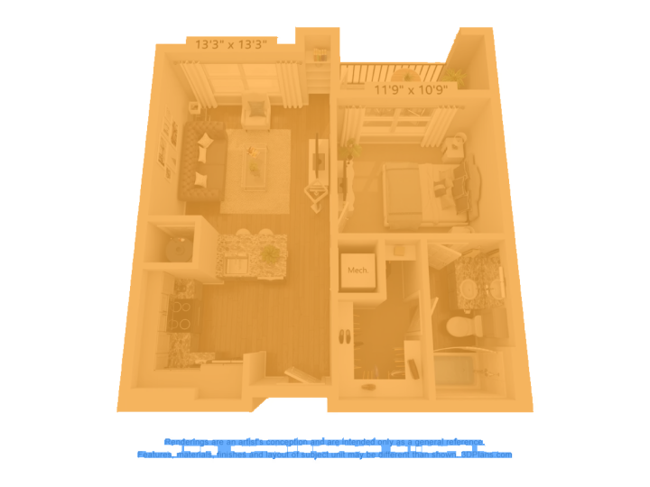

We take the larger one — the disclaimer drops out by itself, without a single
rule about text.

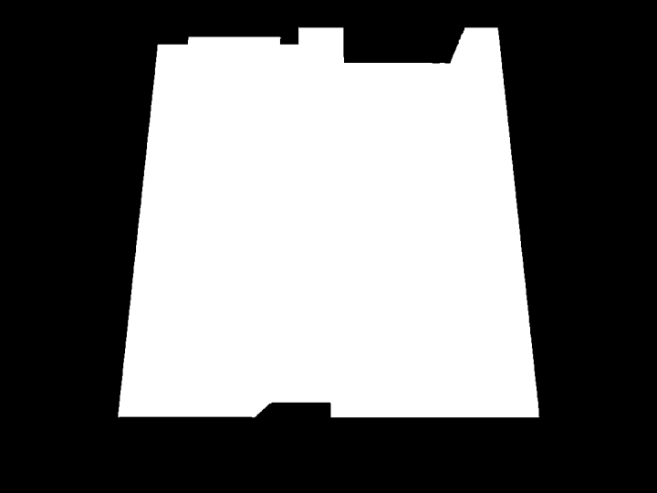

### Operation 1.4 — filling interior pockets

We look for "non-plan" areas that do not touch the image border.

**Result:** on this plan there are **none**, so the operation changes nothing. It
exists for the other renders: on `highlandlux`, for instance, the plan covers
75 % of the frame and almost touches the edges, and a naive implementation using
`floodFill` from point (0, 0) declared everything a hole there.


**Outcome of step 1:** a plan mask of **425,405 px** = 43.6 % of the frame.

---

## Step 2. Learning the wall colour

Goal: determine what colour the walls are **on this particular picture**, without
relying on a fixed threshold.

### Operation 2.1 — building a ring along the contour

The anchoring observation: the outer contour of the plan is always an exterior
wall. We take the difference of two erosions: the mask shrunk by 2 px minus the
mask shrunk by 9 px.

Green shows the interior of the plan, red shows the ring itself, 7 pixels wide:

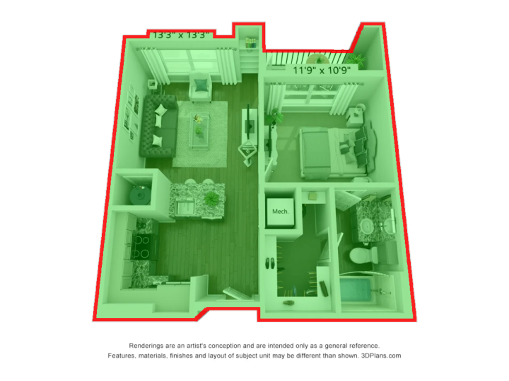

**Result: 20,770** pixels fall into the ring — more than enough of a sample.

### Operation 2.2 — median in CIELAB

We convert the image to Lab and take the median over the ring.


**Result:** `Lab = [219, 127, 129]`, which corresponds to BGR `(213, 215, 214)` —
a light grey. For comparison, the other two renders in the same set give
`L = 235` and `L = 239`; this is exactly why the estimate is redone for every
file.

Why the median rather than the mean: the ring inevitably catches pieces of
furniture by the exterior wall, curtains, plants on the balcony. The median is
robust to such outliers.

---

## Step 3. Finding the walls

### Operation 3.1 — distance to the wall colour

For every pixel we compute the Euclidean distance in Lab to the colour we found
(the "delta E" — in OpenCV's 8-bit Lab encoding, where `L` runs 0–255, so 18
here is roughly 7 CIELAB L\* units rather than a CIE ΔE\*ab). Bright on the map
below means close to the wall colour:

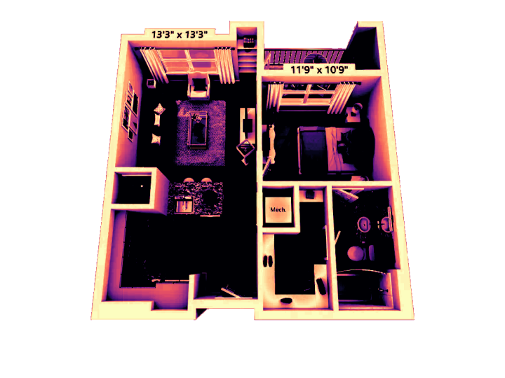

**Distribution of ΔE inside the plan** (percentiles): 10 % — 1, 30 % — 21,
50 % — 51, 70 % — 108, 90 % — 149. The distribution is strongly bimodal: about a
quarter of the pixels match the wall colour almost exactly, the rest are far away.
The threshold of 18 lands in the valley between the modes.

### Operation 3.2 — threshold and morphological opening

```python
raw = plan & (delta < 18)
opened = cv.morphologyEx(raw, cv.MORPH_OPEN, np.ones((3, 3)))
```

| After the threshold | After the opening |
|---|---|
| 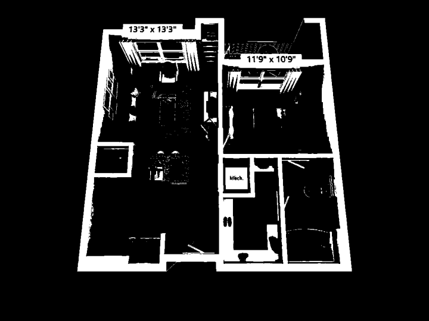 |  |

**Result:** 116,217 → **111,032** pixels; the opening removed 5,185 — isolated
speckle and thin spurious bridges.

### Operation 3.3 — the shape filter: rejecting white furniture

The mask contains **72 connected components**. The largest (the wall network) is
92,184 px, so the threshold is 2 % of that, i.e. 1,843 px.

Colouring by the filter's decision:

- **green** — large components, passed on area (4 of them);
- **blue** — small but elongated ≥ 4 : 1, rescued as wall stubs (18 of them);
- **red** — dropped (50 of them, 4,283 px in total).

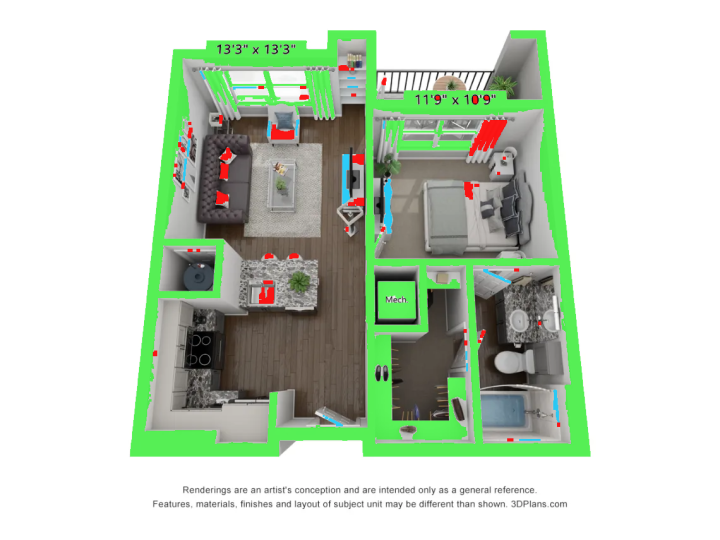

Red marks the sink, the toilet, the bathtub, the white kitchen fronts, the
window sills — everything that is indistinguishable from a wall by colour but
does not look like a wall by shape.


**Result: 106,749 px** of walls = 25.1 % of the plan.

### Operation 3.4 — dilating into the barrier

A wall in the render is three-dimensional: colour only finds its bright top face,
while the dark side face stays "floor". We dilate the mask with a 3×3 kernel,
i.e. by one pixel on each side.

Green marks the walls found by colour, red marks what the dilation added:

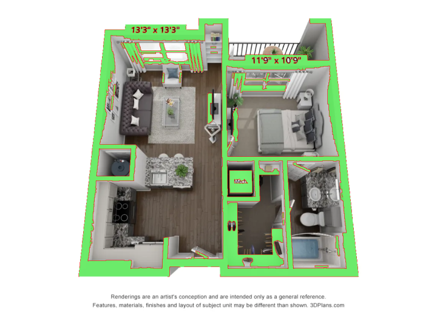

**Result:** 106,749 → **121,203 px** = 28.5 % of the plan. The 14,454 pixels
added are the shaded faces and door frames.

---

## Step 4. Building the terrain

### Operation 4.1 — free space

```python
free = plan & ~barrier
```

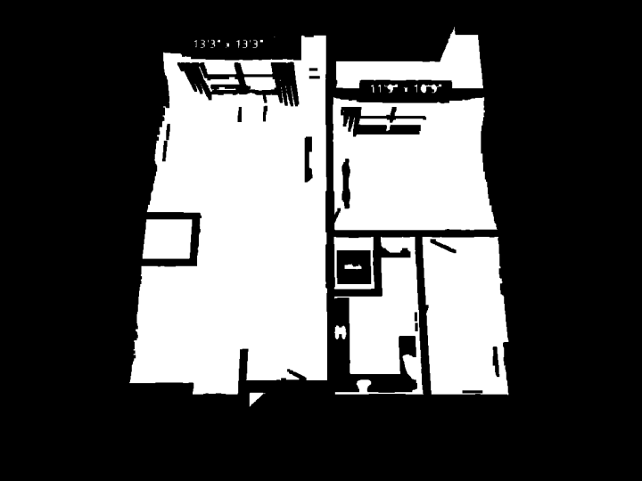

**Result: 304,202 px.** An important observation: this set breaks into **47
connected components**, 9 of them large. In other words, the barrier alone has
already separated most of the rooms — the door frames turned out to be closed off
by the dilation.

### Operation 4.2 — the distance map

For every free pixel, the Euclidean distance to the nearest wall:

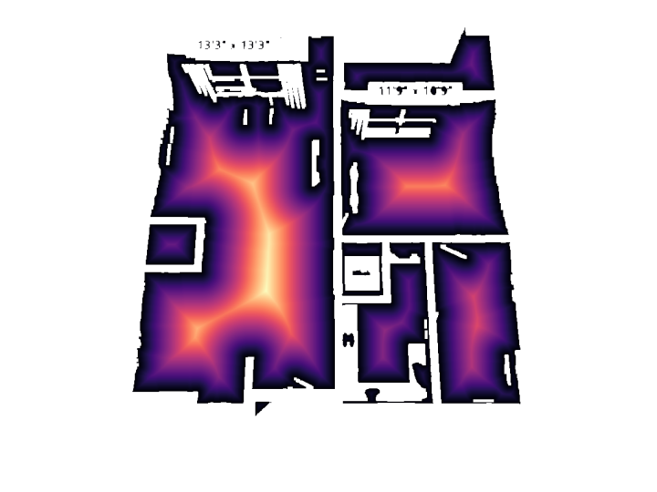

**Result:** the maximum is **116.8 px** — the centre of the most spacious zone.
The "hills" in the middles of the rooms and the narrow necks between them are
clearly visible.

### Operation 4.3 — smoothing

A Gaussian with σ = 2 removes the fine ripple from furniture outlines:


The difference is almost invisible to the eye, but it is decisive for the next
step.

---

## Step 5. Placing the markers

We need one seed point per room.

**The naive approach** — local maxima of the distance map — gives **85 peaks** on
this picture. Every side table, every wall recess spawns its own maximum.

**h-maxima** keeps only the maxima rising at least 10 units above the surrounding
basin:


**Result: 12 markers** instead of 85. They are dilated in the picture for
visibility — in reality they are plateaus a few pixels across.

---

## Step 6. Watershed

We invert the terrain and "pour water" from all 12 markers simultaneously.

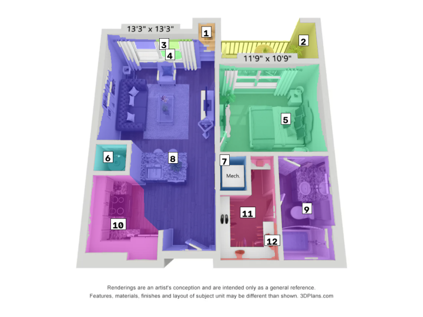

**Result: 12 regions.**

What the watershed actually did here: of the 47 free-space components, the
markers landed in 10, and two of those components received more than one marker —
those are the ones the watershed split. The remaining rooms had already been
separated by the barrier.

---

## Step 7. Merging the spurious cuts

The watershed cuts at any constriction, not only at doors. We check every contact.

There are **4** pairs of touching regions in total. For each we look at the widest
point of the shared boundary:

| Pair | Contact width | Decision |
|---|---|---|
| 8 ↔ 10 | 83.6 px | **merge** — not a door but open space |
| 1 ↔ 8 | 10.6 px | keep — a doorway |
| 3 ↔ 8 | 2.0 px | keep — a doorway |
| 11 ↔ 12 | 4.0 px | keep — a doorway |

Green shows the contact that will be merged, red shows the preserved doorways:

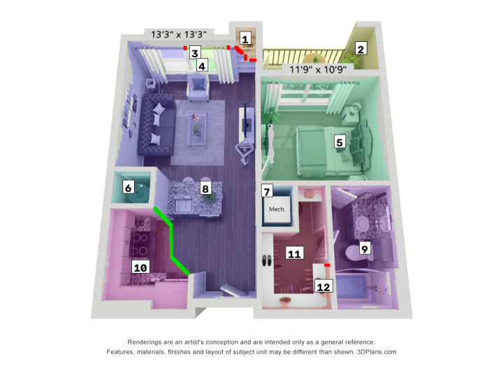

The difference in scale speaks for itself: 83.6 against 2–10 pixels. The
threshold of 16 px sits comfortably between the two groups.

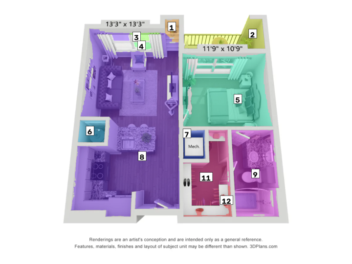

**Result:** 12 → **11 regions**.

---

## Step 8. Clearing the scraps

The threshold is 0.4 % of the plan area = **1,701 px**. In a loop we take the
smallest region and decide its fate.

**It fired twice:**

1. Region 3, **1,589 px**. It has a neighbour — region 8 (8 px of shared
   boundary). Attached to it.
2. Region 4, **1,126 px**. No neighbours at all — an isolated islet cut off by
   the barrier on every side. **Attached to the nearest full-sized region**
   (Euclidean distance), which is the open-plan region 6.

The second case is worth understanding: an earlier version simply deleted such
an islet, and its 1,126 px ended up in no room at all — the shares of every
other room were then computed against a total that was silently too small.

After consecutive renumbering:


**Outcome of the geometric stage: 9 regions.**

Summary of steps 5–8:

| Operation | From | To |
|---|---|---|
| markers (h-maxima instead of peaks) | 85 peaks | 12 markers |
| watershed | 12 markers | 12 regions |
| merging wide contacts | 12 | 11 |
| absorption (one scrap into its neighbour, one islet into the nearest room) | 11 | **9** |

---

## Step 9. Polygons and areas

### Operation 9.1 — contour and simplification

For every room we take the outer contour (`RETR_EXTERNAL`) and simplify it with
Douglas–Peucker at a tolerance of 0.4 % of the perimeter.

A close-up on region 8: grey dots are the original contour points, red dots are
the vertices of the simplified polygon:

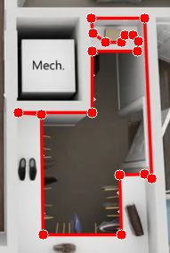

**Result for this room:** 98 points → **18 vertices**, shape preserved.

Across all rooms:

| id | Area, px | Share | Estimate, sq ft | Contour points | Vertices after simplification |
|---|---|---|---|---|---|
| 6 | 160,936 | 53.3 % | 316.3 | 417 | 22 |
| 3 | 56,720 | 18.8 % | 111.5 | 175 | 11 |
| 7 | 37,094 | 12.3 % | 72.9 | 141 | 13 |
| 8 | 20,383 | 6.8 % | 40.1 | 98 | 18 |
| 2 | 12,848 | 4.3 % | 25.2 | 109 | 11 |
| 4 | 5,776 | 1.9 % | 11.4 | 27 | 4 |
| 5 | 2,725 | 0.9 % | 5.4 | 34 | 7 |
| 1 | 2,697 | 0.9 % | 5.3 | 27 | 16 |
| 9 | 2,578 | 0.9 % | 5.1 | 117 | 20 |

Region 6 includes the 1,126 px islet from step 8; it is a separate blob inside
the room, so the outer contour and its vertex count are unaffected.

Contour compression ranges from 4× to 19×.

### Operation 9.2 — areas

The total room area is **301,757 px** — every free-space pixel that survived
step 8 is in exactly one room. The relative area of each room is its
share of that total, which is why the shares sum to exactly 1.0.

The file name carries `593 Sq. Ft.`, so we additionally convert to square feet:
one pixel ≈ 0.00197 sq ft.

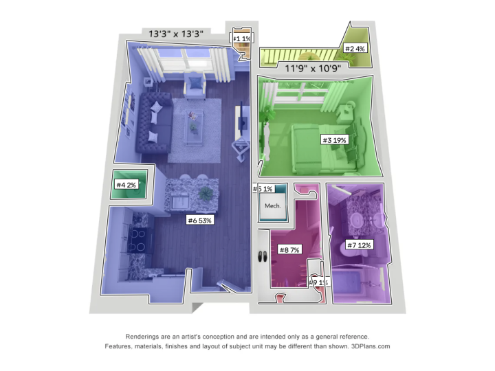

**This is the result of the pure geometric pipeline** — what lands in
`output/*.png` and `output/*.json` without the `--semantics` flag.

The main problem is visible too: region 6 takes 53 % of the plan. It is a single
kitchen + dining + living + entry space, and geometry does not divide it, because
there is no wall between them.

---

## Step 10. Room names and the open-plan split

### Operation 10.1 — the image for the model

The model receives two pictures: the clean render and this one, with numbers on
white plates.


The large font on an opaque plate is not cosmetics: with small thin digits the
model confused the numbers and called the balcony a living room.

### Operation 10.2 — the model's answer

The answer comes back strictly following the pydantic schema. What it returned:

| id | Name | Zones |
|---|---|---|
| 1 | balcony | — |
| 2 | entry | — |
| 3 | bedroom | — |
| 4 | closet | — |
| 5 | mechanical | — |
| **6** | **open plan** | kitchen (300, 600), living room (200, 400), dining room (400, 500) |
| 7 | bathroom | — |
| 8 | hallway | — |
| 9 | closet | — |

The model correctly recognised that region 6 is an open area and produced three
anchor points for it:

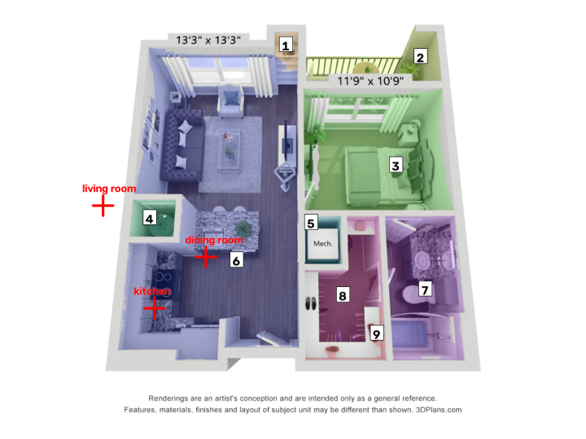

The weakness of the approach is visible right here: the coordinates are
suspiciously round — (300, 600), (200, 400), (400, 500). The model estimated them
rather than measured them.

### Operation 10.3 — the geodesic Voronoi split

A marker is placed at each anchor point and a watershed is run over the region
with a **flat** terrain. Every pixel goes to the nearest marker, with the distance
measured inside the region.

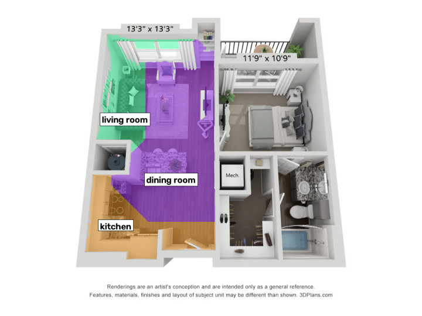

**Result:** region 6 (159,810 px) split into dining room 90,662, kitchen 39,320
and living room 29,828 px.

> The model run shown in this step predates the islet change in step 8, which
> is why its zones sum to 159,810 px rather than the 160,936 px above; the
> shares and square-foot figures in the two tables below inherit that total.

### Operation 10.4 — the outcome

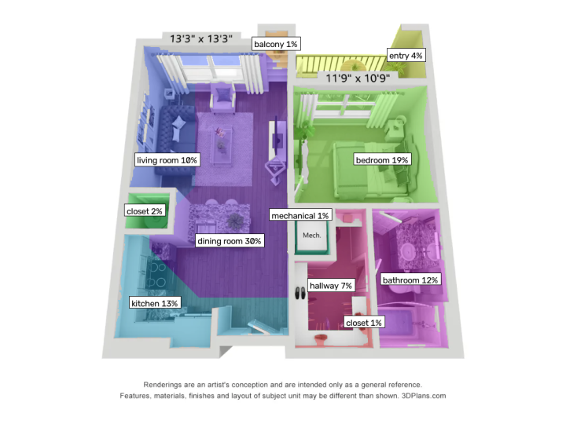

**9 geometric regions → 11 named rooms:**

| Name | Area, px | Share | Estimate, sq ft |
|---|---|---|---|
| dining room | 90,662 | 30.2 % | 178.8 |
| bedroom | 56,720 | 18.9 % | 111.9 |
| kitchen | 39,320 | 13.1 % | 77.6 |
| bathroom | 37,094 | 12.3 % | 73.2 |
| living room | 29,828 | 9.9 % | 58.8 |
| hallway | 20,383 | 6.8 % | 40.2 |
| entry | 12,848 | 4.3 % | 25.3 |
| closet | 5,776 | 1.9 % | 11.4 |
| mechanical | 2,725 | 0.9 % | 5.4 |
| balcony | 2,697 | 0.9 % | 5.3 |
| closet | 2,578 | 0.9 % | 5.1 |

---

## Checking the result

### What came out right

The bedroom, bathroom, hallway, closets and `Mech.` are segmented correctly and
with plausible areas. The open area was divided into three parts — something
geometry could not do in principle.

### An independent check against the printed dimensions

The plan has the dimensions of two rooms printed on it — ground truth that exists
nowhere else:

| Room | Printed | In sq ft | Our estimate | Difference |
|---|---|---|---|---|
| bedroom | `11'9" x 10'9"` | 126.3 | 111.5 | **−11.7 %** |

The shortfall is expected and systematic: the room boundary follows the **visible
floor** rather than the wall centreline, and the barrier eats another pixel
around the perimeter. The printed dimension is measured between wall axes.

### What came out wrong

An honest breakdown of the errors on this run:

- **Labels swapped.** Region 2 (25.3 sq ft) is the balcony, and the model called
  it `entry`; region 1 (5.3 sq ft) is a shelving niche, called `balcony`.
- **The open-plan zone boundaries are imprecise.** `dining room` got 178.8 sq ft
  and became the largest room, although visually the dining area is smaller than
  the living room. The cause is the round, estimated anchor coordinates and the
  straight Voronoi lines.
- **The result is unstable between runs.** At `temperature=0` repeated calls
  still disagree: another run on the same file split it as `living room` 142.4 /
  `dining room` 104.1 / `kitchen` 68.7 sq ft instead of 58.8 / 178.8 / 77.6.

This is why the semantic stage is off by default: it demonstrates **how** the
open-plan gap would be closed, but it is not a finished component.

---

## What this example revealed about the algorithm

Three conclusions that only become visible on concrete numbers.

**1. The barrier, not the watershed, does most of the work of separating rooms.**
The free space broke into 47 components before the watershed even ran, and 9 of
them were large. Dilating the walls by one pixel on each side closes the door frames, and the
rooms end up separated automatically. The watershed split only 2 components out
of 47. On `limestone ranch` it split none at all — there the result coincides with
plain connectivity of the free space.

**2. The contact-width threshold separates two clearly distinct classes.** The
single merged contact was 83.6 px wide; the three preserved doorways were 2.0,
4.0 and 10.6 px. The gap between the groups is almost eightfold, so the 16 px
threshold is not fitted to the data.

**3. The shape filter does more than it appears.** Of the 72 wall-colour
components, 50 were dropped — that is, every second connected area that looks
like a wall by colour is not a wall. Without this filter the sanitary ware and
the white kitchen would cut the bathroom and the kitchen into pieces.

The limitations this example highlights most clearly — the 11 % shortfall in
areas and the unreliability of the semantic labels — are discussed in detail in
[ALGORITHM.md](ALGORITHM.md#limitations).
