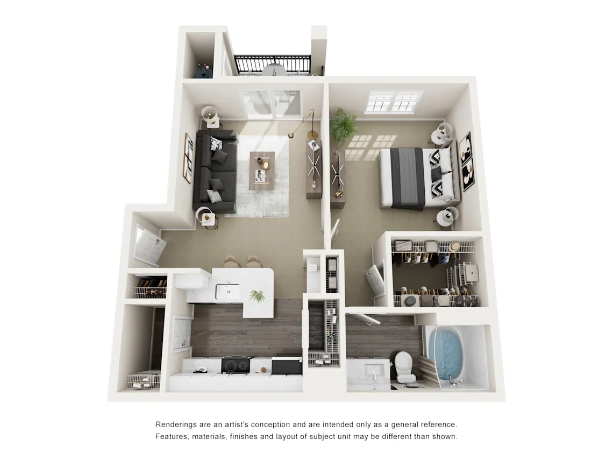
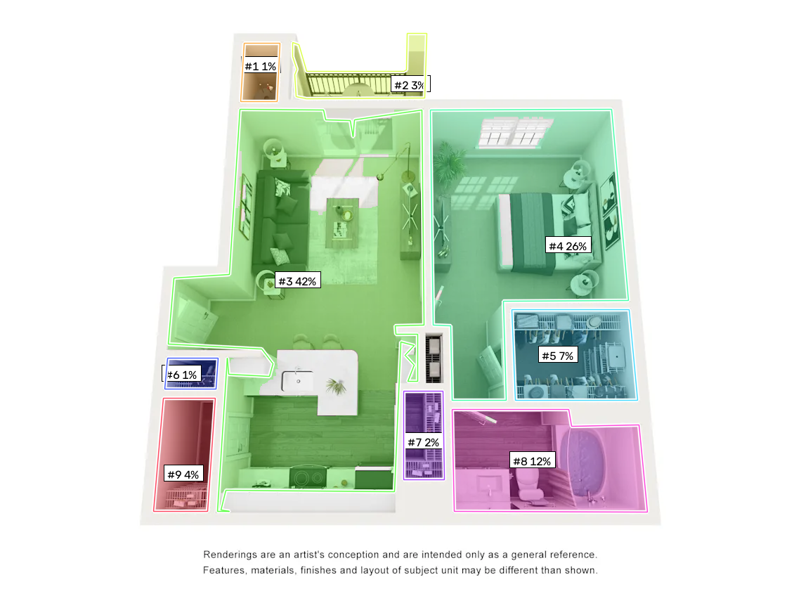
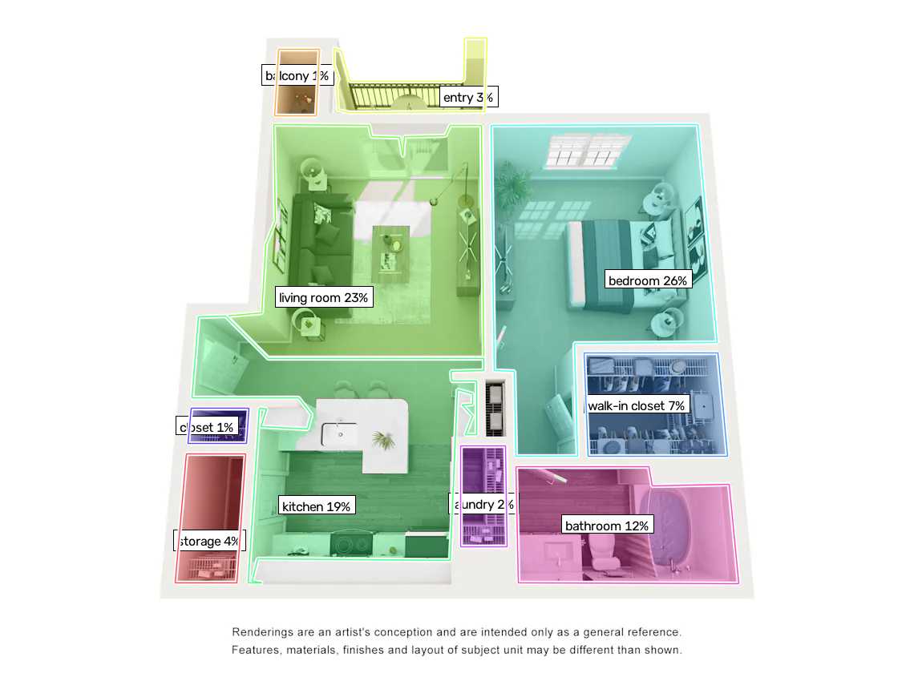

# FloorplanVLM: Vision-language model for structure-first floorplan JSON

**Date:** 2026-09-20  
**Paper:** FloorplanVLM: A Vision-Language Model for Floorplan Vectorization  
**Venue:** arXiv:2602.06507, June 2026  
**Authors:** Xiao Xue, Yang Zhang, Qirui Liu, Chengye Li, Li Niu, Yuhao Wang, Hong Yan, Lei Zhang  
**Links:** [arXiv](https://arxiv.org/abs/2602.06507) · [PDF](https://arxiv.org/pdf/2602.06507) · [HF datasets](https://huggingface.co/datasets/FunctionFloorplan/FPBench-2K) · [Project](https://functionfloorplan.github.io/)  
**Benchmarks:** FPBench-2K (in-paper eval), Floorplan-2M (SFT), CubiCasa-derived public LoRA examples

---

## What it does

FloorplanVLM turns **raster floorplan images** (architectural drawings, CAD screenshots, hand-sketches) into **structured JSON** via a **structure-first two-stage** vision-language model. Instead of predicting all polygons in parallel (RoomFormer, CAGE) or corners/edges sequentially (Raster2Seq), it first emits the **wall skeleton** as reference primitives, then separately describes **rooms as references to wall IDs**, mimicking how architects compose plans.

Core pieces:

1. **Qwen2.5-VL base.** The model is built on Qwen2.5-7B-Instruct (multimodal LLM trained for visual reasoning). FloorplanVLM adds domain-specific supervised fine-tuning (SFT) + Group Relative Policy Optimization (GRPO, a preference-learning variant) on floorplan-specific JSON outputs.
2. **Structure-first JSON schema.** Walls are emitted first as `{id, geometry}` entries (typically line segments or short polylines representing wall centerlines). Rooms are then defined as `{room_type, wall_references: [id1, id2, ...], centroid}`. Doors and windows reference the walls they pierce.
3. **Floorplan-2M SFT + FPBench-2K evaluation.** Training uses Floorplan-2M (mostly CubiCasa5K + augmented variants, scaled to 2M image-JSON pairs via data augmentation and synthetic layouts). FPBench-2K is a held-out test set with diverse drawing styles (CAD clean, hand-sketch, scanned blueprints).
4. **Reported accuracy:** ~92.5% external-wall IoU, ~88.1% room F1, ~82.3% door/window alignment precision on FPBench-2K. GRPO improves JSON well-formedness by ~6 points over SFT-only (fewer malformed `wall_references`, better closure).

The key insight: **decomposing the task into structure + reference** aligns with how humans and CAD tools construct plans, and lets the VLM leverage its reasoning about spatial relationships ("this room is bounded by walls 3, 7, 12") rather than only regressing raw coordinates.

---

## Why it matters for COXIT_test_task

Our deliverable is **room polygons + relative areas (+ optional names)** from a photorealistic top-down render. FloorplanVLM's native output — room types + wall-reference descriptors — is closer to a **semantic + topological** representation than coordinate polygons, making it both more expressive and more brittle:

| Need in this repo | FloorplanVLM | Current pipeline |
|---|---|---|
| Outer room polygons | Reconstructed from wall references | Watershed masks → contours |
| Room names | First-class in JSON | Separate VLM `--semantics` stage |
| Doors / windows | Explicit with wall associations | Implicit (doorways = narrow passes) |
| Topology | Explicit wall-sharing graph | Implicit from mask overlap |
| Relative areas | Must recompute from reconstructed geometry | Direct from mask pixels |
| CPU / no-weights default | No — LLM inference + multimodal encoder | Yes (115–290 ms) |

### Example outputs on this repo's pipeline

Below are visualizations from the existing classical watershed pipeline on `data/limestone ranch_santa fe_625sq.webp` (625 sq ft marketing render). These illustrate the type of input FloorplanVLM would need to process and the geometric baseline it must beat.

#### Input render

A typical 3DPlans-style photorealistic render with extruded walls, textured floors, furniture, and lighting. The advertised total is 625 sq ft.

#### Geometric segmentation (classical watershed)

Current pipeline output: 9 regions found via barrier-masked watershed, h-maxima markers, and passage-width merge heuristics. The large 42.4% region is open-plan (kitchen + living + entry); geometry alone cannot split it. Regions are numbered by decreasing area and colored for visibility. Polygons and relative areas are exported to JSON.

#### Semantic segmentation (watershed + VLM naming)

Same geometry with VLM naming: the 42.4% open region is split into **living room 23.4%** + **kitchen 19.1%** via geodesic Voronoi around VLM-provided anchors. Other rooms are named: bedroom, bathroom, closets, balcony. FloorplanVLM's structure-first approach would aim to produce these names + polygons + door/window associations in one JSON pass — but on a photoreal 3D render, not a CAD drawing.

---

## Transferable ideas (even if we do not ship the full model)

### 1. Structure-first composition as a design pattern
The wall→room reference cascade is reusable beyond VLMs. Our pipeline could export walls (barrier contours after filtering) as reusable primitives, then describe rooms as "bounded by wall segments A, B, C" rather than only polygon vertices. Useful for:
- Downstream CAD import (walls are first-class entities, not just polygon boundaries)
- Semantic editing ("move wall 7 outward 1 ft") vs re-segmenting the entire plan
- Door/passage annotation (reference the walls each doorway breaks)

### 2. JSON schema alignment
FloorplanVLM's schema separates `walls`, `rooms`, `doors`, `windows`. Our current schema only has `rooms[].polygon`; adding `walls[]` + `rooms[].wall_ids` would let us express topology explicitly. If we ever train a structured model (README next-step #4), this schema is the natural target over raw corner sequences.

### 3. Preference optimization for JSON well-formedness
GRPO (the paper's RLHF-style stage) penalizes malformed JSON, missing `wall_references`, and unclosed rooms. If we fine-tune any generative model on pseudo-labels from watershed, applying GRPO with simple rules (valid polygon closure, area sum ~1.0, non-overlapping) could reduce hallucination.

### 4. VLM as a fallback for hard cases
Instead of replacing the classical pipeline, invoke FloorplanVLM (or a similar VLM) only when geometric heuristics fail: rooms >40% of plan area, room count outliers, or when `--semantics` split quality is poor. The VLM's reasoning about furniture arrangement and spatial relationships could resolve ambiguous open-plan boundaries.

---

## Gaps and caveats

### 1. Domain gap (critical)
- **FloorplanVLM training:** CAD drawings, architectural rasters, scanned blueprints from Floorplan-2M (mostly CubiCasa5K style — line-based wall representations, no photorealism, minimal texture)
- **COXIT input:** Photorealistic 3DPlans-style marketing renders with extruded walls, furniture, shadows, reflections, and floor textures
- The modality is fundamentally different: FloorplanVLM learns wall/door/window detection from clean line drawings; 3D renders have fuzzy boundaries, occlusion, and material clutter.

**Consequence:** Zero-shot transfer is likely to fail. Walls may not be recognized from shaded vertical faces; furniture may be mistaken for structural elements; floor finish changes (tile vs wood) may be hallucinated as walls.

### 2. Reconstruction from wall references is error-prone
The VLM outputs `wall_references: [3, 7, 12]`, not polygon coordinates. A post-processing step must:
- Parse the wall IDs
- Look up their geometries (line segments or polylines)
- Chain them into a closed polygon (assuming correct ordering and endpoint continuity)
- Handle malformed references (missing IDs, unclosed loops, contradictory topology)

The paper reports ~6% of outputs have malformed wall-reference lists even after GRPO. For a production deliverable requiring pixel-area accuracy, this brittleness is a liability.

### 3. Relative area must be recomputed
Our JSON schema requires `relative_area` (room pixels / total room pixels), which is a direct byproduct of mask-based segmentation. FloorplanVLM outputs wall-reference room descriptors; pixel areas must be:
1. Reconstructed by rasterizing the closed polygon from chained wall segments
2. Summed to compute `relative_area`
3. Validated (does the sum equal ~1.0? are there gaps or overlaps?)

Classical watershed gives relative areas by construction; FloorplanVLM adds error propagation from wall parsing → polygon closure → rasterization.

### 4. Model size and inference cost
- **Qwen2.5-7B base:** ~14 GB FP16 weights, GPU memory for vision encoder + LLM decoder, ~2–10 s/image on consumer GPU (unoptimized)
- **Current baseline:** 115–290 ms CPU-only, no network, no model weights

Acceptable for batch offline processing or research experiments; prohibitive for real-time / edge deployment or cost-conscious cloud inference.

### 5. Open-plan living+kitchen still relies on semantics
FloorplanVLM's structure-first approach emits room types and wall associations, but when two functional zones (kitchen, living room) share no physical wall, the JSON must either:
- Represent them as one room with a compound type (e.g., `"kitchen-living"`)
- Invent a virtual wall boundary that does not exist in the image

The latter is an architectural judgment, not a pure vision task. The paper shows examples of open-plan areas being correctly named but does not detail how boundaries are chosen when no wall exists. Our VLM geodesic Voronoi split is an explicit heuristic; FloorplanVLM likely learns a similar implicit rule, but it is opaque.

### 6. No public code yet
As of this note's date, the arXiv paper references a project page and HuggingFace datasets (FPBench-2K for evaluation, CubiCasa-derived LoRA examples), but no official inference code or pretrained checkpoints are available. Reproduction would require:
- Qwen2.5-VL base model + paper's SFT/GRPO recipe
- Floorplan-2M training data (not publicly released in full; CubiCasa5K is available, augmentation pipeline is described but not code-released)
- Post-processing scripts to chain wall references into polygons

**Conclusion:** exploratory experiments are blocked until the authors release checkpoints or a third party implements the architecture.

---

## Concrete experiment path

### Precondition: Wait for public checkpoint or third-party reproduction

Once inference code is available:

### Option A: Zero-shot smoke test on photoreal renders
1. **Preprocessing:** Convert `data/*.webp` to the expected input format (likely 512×512 or 1024×1024 RGB, possibly with a sketch-like edge map overlay to emphasize structure).
2. **Inference:** Run FloorplanVLM with default prompt (e.g., `"Generate the floorplan JSON for this image"`) and collect the JSON output.
3. **Post-process:** Parse `walls[]` and `rooms[].wall_references`, chain wall segments into closed polygons, rasterize to compute `area_px`, compute `relative_area`.
4. **Evaluate on the three samples:**
   - Room count vs ground truth (~10 / ~9 / ~7 for limestone / heritage / highlandlux)
   - Qualitative: Are walls correctly identified from shaded vertical faces? Is furniture misclassified as structure? Are room names plausible?
   - Failure modes: Malformed JSON, unclosed room references, wall segments that do not connect.

### Option B: Preprocessing bridge to close the domain gap
If zero-shot fails (likely):
1. **Structure emphasis:** Feed a wall-highlighted map instead of raw RGB:
   - Invert the barrier mask (walls white, floor black)
   - Or apply Canny edge detection + dilate to emphasize boundaries
   - Or composite: overlay strong wall edges on a desaturated render
2. **Re-run FloorplanVLM:** The input now looks more like a CAD line drawing (the domain it was trained on).
3. **Compare:** Does structure emphasis improve wall detection? Are fewer furniture items mistaken for walls?

### Option C: Fine-tune on marketing renders (long-term)
If zero-shot and preprocessing bridges are insufficient:
1. **Pseudo-label generation:** Run the current pipeline on 100–500 marketing renders, manually correct the worst 20–30, keep the rest as silver-standard.
2. **Schema conversion:** Convert watershed polygons + VLM names into FloorplanVLM's JSON schema (`walls[]` extracted from barrier contours, `rooms[].wall_references` inferred from polygon boundaries).
3. **LoRA fine-tuning:** Fine-tune Qwen2.5-VL with LoRA on the pseudo-labeled dataset, then apply GRPO with rules for valid wall references and closed rooms.
4. **Validate:** Does the fine-tuned model generalize to held-out marketing renders better than the classical pipeline? Is it robust to palette / style variation (limestone beige vs highlandlux warm tones)?

---

## Relation to existing notes

| | [FloorSAM](2026-09-20-floorsam-sam-guided-room-segmentation.md) | [Raster2Seq](2026-09-20-raster2seq-polygon-sequence-floorplan.md) | [CAGE](2026-09-20-cage-continuity-aware-edge-floorplan.md) | FloorplanVLM (this note) |
|---|---|---|---|---|
| Input family | LiDAR → BEV density | Raster drawing / density | Point cloud → density | Architectural raster drawing |
| Output representation | SAM masks → contours | Autoregressive labeled corners | Directed continuous edges | **Structured JSON: walls + room references** |
| Semantics | Optional fusion | First-class in corner tokens | Optional extension | **First-class with wall associations** |
| Topology | Implicit from masks | Sequence closure | Edge continuity | **Explicit wall-sharing graph** |
| Best COXIT hook | Barrier + h-maxima as SAM prompts | Structured polygon+name head | Edge-prior vector head | **VLM fallback for hard open-plan cases** |
| Inference cost | SAM ViT-B: ~400 MB, GPU | PyTorch head: ~200 MB, GPU | Swin+ops: ~500 MB, GPU | **Qwen2.5-7B: ~14 GB, GPU, 2–10 s** |

**Positioning:** FloorplanVLM is the **most expressive and most expensive** option. Use it when:
- Room names, door/window associations, and explicit topology are required in one pass
- Inference latency and GPU memory are acceptable trade-offs for semantic richness
- The domain gap (CAD → photoreal 3D) can be closed via fine-tuning or preprocessing

For the default fast geometric deliverable, FloorSAM / Raster2Seq / CAGE + classical preprocessing are more cost-effective. FloorplanVLM is a research candidate for README next-step #4 (structured model with joint geometry + semantics), contingent on checkpoint availability.

---

## Summary

FloorplanVLM is a **Qwen2.5-VL-based structure-first floorplan vectorizer** that emits JSON with walls as primitives and rooms as wall-reference lists, achieving ~92.5% external-wall IoU on FPBench-2K CAD/drawing benchmarks. For COXIT's photorealistic render input, the core transferable ideas are:
1. **Structure-first JSON schema** (walls + room references) as a design pattern for downstream CAD compatibility and semantic editing
2. **VLM as a fallback** for hard open-plan cases where geometric heuristics fail
3. **Preference optimization (GRPO)** to reduce malformed JSON in generative polygon models

The main gaps are: (a) critical domain gap (CAD drawings → photoreal 3D renders), (b) brittle reconstruction from wall references, (c) high inference cost (7B VLM vs 290 ms classical), and (d) no public checkpoint yet. A concrete experiment (zero-shot on `data/*.webp` + structure-emphasized preprocessing) would measure transfer viability once code is released. Until then, FloorplanVLM is a methodological reference for structured output design, not a drop-in alternative to watershed segmentation.
