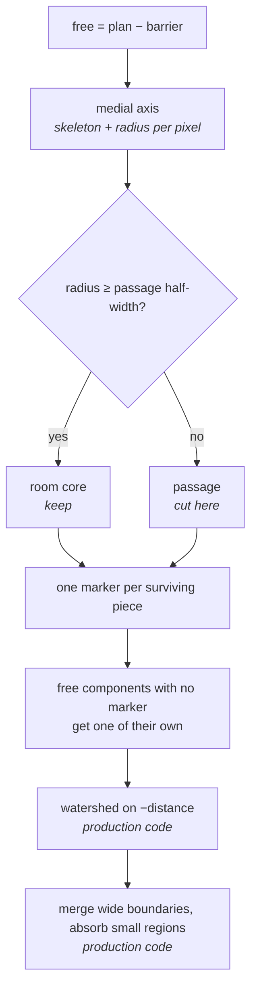
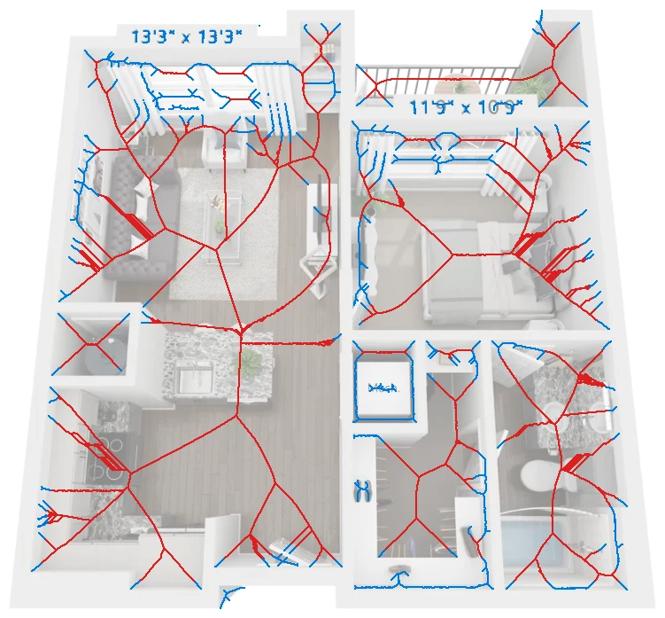
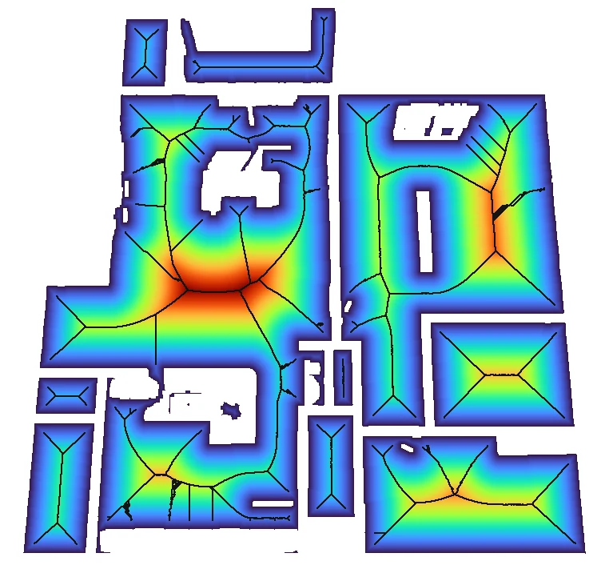
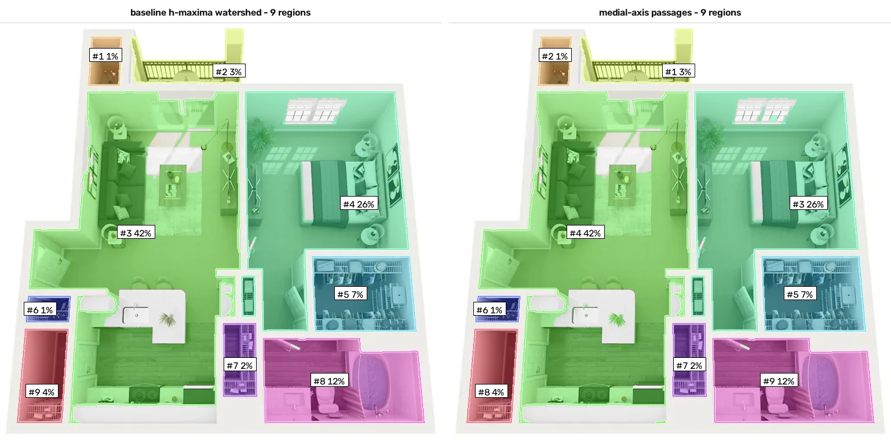
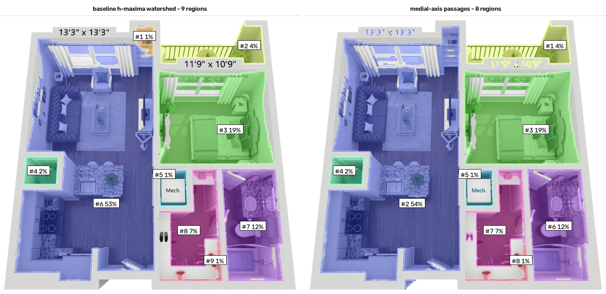
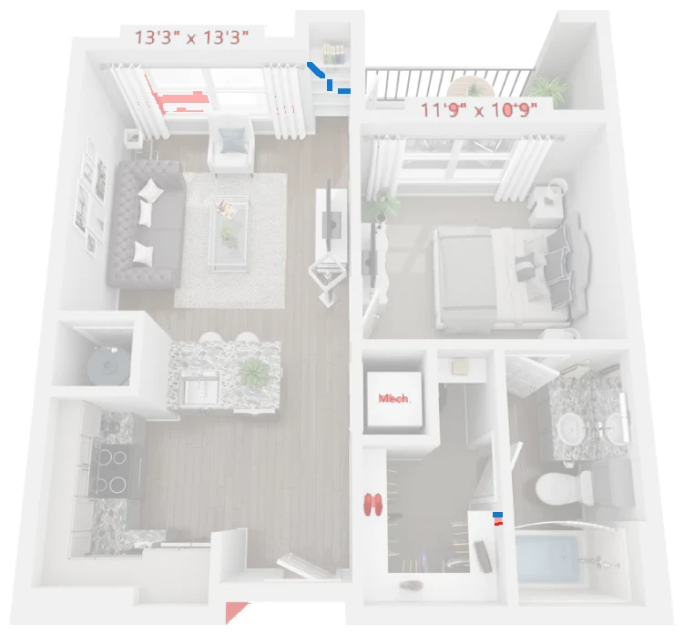
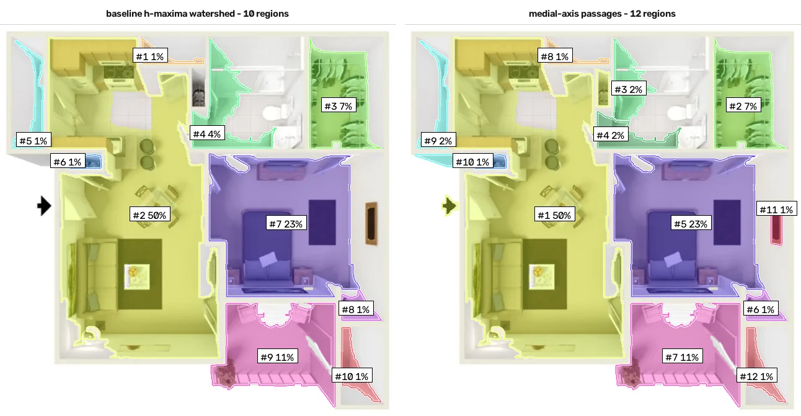
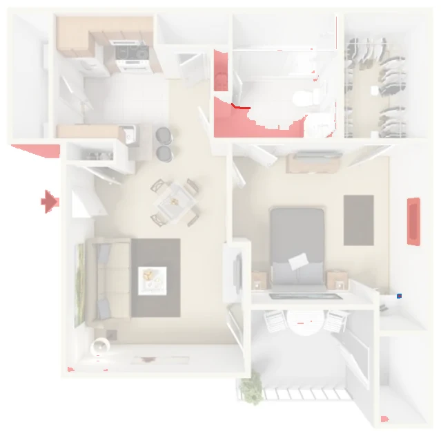
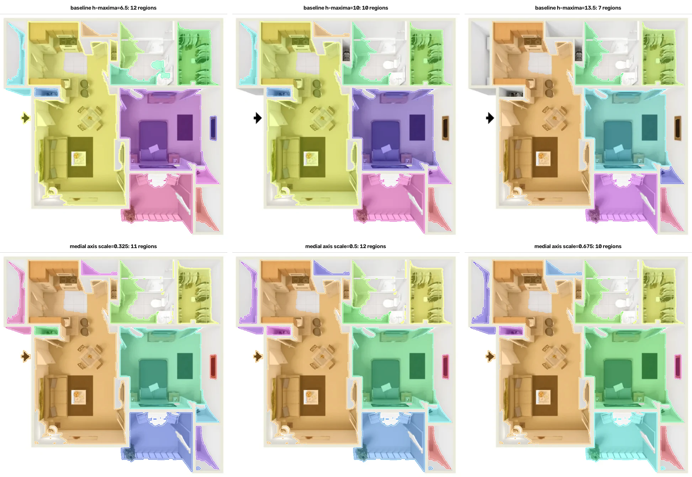

# Rooms from the medial axis, cut at passages

**What it replaces:** step 5 of the production pipeline — the *h-maxima* markers
that seed the watershed ([root ALGORITHM.md, step 5](../../ALGORITHM.md#step-5-markers-via-h-maxima)).
Everything before (plan mask, wall colour, barrier, distance transform) and
everything after (watershed, wide-boundary merge, small-region absorption,
polygons) is the production code, unchanged.

**Result on the three samples in `data/`:**

| Render | Baseline | This approach | Free space kept | Pixels kept | Mean IoU |
|---|---|---|---|---|---|
| limestone ranch | 9 regions | **9** | 0.998 → 0.999 | 100 % | 1.00 |
| heritage towers | 9 regions | **8** | 0.992 → 0.997 | 100 % | 0.98 |
| highlandlux (beige) | 10 regions | **12** | 0.975 → 0.993 | 98 % | 0.97 |

Same rooms on the easy render, one spurious region removed on the second, and
on the low-contrast third: four slivers of floor recovered that the baseline
silently dropped, plus one bathroom wrongly cut in two. The method is also
**less sensitive to its parameter** (region count moves by 0–2 over a ±35 %
sweep, against 0–5 for the baseline) and slightly faster.

---

## Contents

1. [Why touch the marker stage at all](#1-why-touch-the-marker-stage-at-all)
2. [The idea](#2-the-idea)
3. [Step by step](#3-step-by-step)
4. [Applied to the three renders](#4-applied-to-the-three-renders)
5. [Numbers](#5-numbers)
6. [Reproducibility: a random tie-break and how to avoid it](#6-reproducibility-a-random-tie-break-and-how-to-avoid-it)
7. [What improved, what got worse](#7-what-improved-what-got-worse)
8. [Limitations](#8-limitations)
9. [Regenerating the assets](#9-regenerating-the-assets)

---

## 1. Why touch the marker stage at all

The baseline puts one marker per "hill" of the distance map that rises at least
`h = 10` px above the surrounding saddle, then repairs the damage afterwards:
adjacent regions whose shared boundary is *wider* than 16 px get merged again,
because the watershed also cuts at constrictions that are not doors. Two things
are unsatisfying about that:

- **`h` is not a length you can look up in the image.** It is a contrast in a
  distance map. A door is 32 inches wide; that fact does not translate into a
  value of `h` without experiment.
- **`h` is absolute in pixels**, so it is tied to the resolution of the render.
  The three samples happen to be 659–1140 px wide; a 2000 px render would need
  a different `h`.

And a third, found while measuring for this document: on these renders the
marker stage matters far less than it looks. The barrier already disconnects
most rooms from each other. Labelling the **connected components** of the free
space and running only the production tail gives 7 / 10 / 9 regions against the
baseline's 9 / 10 / 9 — the whole watershed adds two regions on one image and
nothing on the other two. Whatever replaces the markers is therefore arbitrating
a handful of cases, not the whole segmentation. That is worth knowing before
reading any of the differences below as a triumph.

## 2. The idea

A room is a part of the free space that is *wide*; a doorway is a part that is
*narrow*. The medial axis makes that statement operational, because every
skeleton pixel carries the radius of the largest disc that fits inside the free
space at that point.



The threshold is a width in pixels, and it is **measured from the image**: half
the wall thickness, which the wall mask already tells us. A door opening in
these renders is about one wall thickness wide.

## 3. Step by step

Code: [`approach.py`](approach.py). Configuration:
`RidgeCutConfig(passage_scale=0.5, marker_source="ridge", min_ridge_px=25, min_orphan_frac=0.0005, rng_seed=0)`.

### 3.1 The threshold, from the wall mask

`wall_thickness()` takes the distance transform *inside* the wall network — it
peaks on the centreline — and doubles its 90th percentile. The percentile, not
the maximum, because the colour threshold leaves speckle and the occasional
fat blob of white furniture.

| Render | Wall thickness | Cut at radius | Plan size |
|---|---|---|---|
| heritage towers | 20.0 px | 10.0 px | 1140 × 855 |
| highlandlux | 32.0 px | 16.0 px | 659 × 651 |
| limestone ranch | 24.0 px | 12.0 px | 1140 × 855 |

The estimate is generous: it measures the *barrier-forming structure*, which
includes the shaded vertical face of an extruded wall, not the drawn wall alone.
That is the right quantity here, since the free space is bounded by the barrier.

### 3.2 Cutting the axis

```python
skeleton, distance = medial_axis(free, return_distance=True, rng=cfg.rng_seed)
ridge = skeleton & (distance >= half_width)
```



*Blue: the full medial axis. Red: what survives the cut. Every red piece
becomes one room marker; the blue stubs are doorways, furniture gaps and the
spurs the skeleton grows into every corner.*

The same cut seen on the distance map, with the passages the final partition
ended up using:



*Colour is the distance to the nearest barrier — red in the middle of a room,
blue in a passage. Black is the surviving ridge. On this render the rooms are
already disconnected by the barrier, so no room-to-room passage is left to mark.*

Fragments shorter than `min_ridge_px = 25` are dropped: a long passage bulges
slightly in the middle and would otherwise seed a "room" inside the doorway.

### 3.3 Components that hold no marker

A free-space component that is narrower than a passage *everywhere* — a niche,
a shallow closet, the strip of floor a weak wall mask leaves along a wall — has
no ridge above the threshold. The watershed is masked by `free`, so such a
component would come back **unlabelled**, and its area would vanish from the
result without any error.

This is not hypothetical: the baseline loses **2.5 % of the free space** on
`highlandlux` and 0.8 % on `heritage towers` exactly this way. `_seed_unmarked_components`
gives every such component a marker of its own (above 0.05 % of the plan;
below that they are antialiasing crumbs), and lets the production absorption
decide whether it is a room or part of a neighbour. Free-space coverage after
that: 0.997 / 0.993 / 0.999, against 0.992 / 0.975 / 0.998 for the baseline.

### 3.4 Two ways to make the same cut

`distance >= half_width` *is* an erosion of the free space by a disc of that
radius. So the skeleton is not strictly necessary: one can threshold the
distance map directly and label the resulting blobs. `marker_source="cores"`
does that.

| | ridge (default) | cores |
|---|---|---|
| Needs the medial axis | yes | no |
| Deterministic | only with a fixed `rng` | always |
| Runtime, 1140 × 855 | 0.25–0.37 s | 0.18–0.30 s |
| Regions on the three samples | 8 / 12 / 9 | 8 / 12 / 9 |
| Agreement with the ridge variant | — | IoU 1.00 on all three |

They agree pixel for pixel at the default threshold. The ridge variant is kept
as the default because the skeleton is what makes the method *legible* — the
figure above shows exactly where and why each cut happens — and because the
passage measurement below hangs off it. If this were to go into production, the
core variant is the one to ship.

### 3.5 Measuring the doorways

`passages()` reports, for every pair of neighbouring rooms, the widest point of
their shared boundary — the pass the watershed came through:

| Render | Passages found |
|---|---|
| heritage towers | rooms 7–8, 8.0 px |
| highlandlux | rooms 5–6, 4.0 px; rooms 3–4, 27.8 px |
| limestone ranch | none: every region is fully enclosed by barrier |

The 27.8 px one on `highlandlux` is the bad cut discussed below. The output is
a by-product of the method, not an extra stage, and it is a cheap sanity check:
a "doorway" 28 px wide in a plan whose walls are 32 px thick is not a doorway.

## 4. Applied to the three renders

### limestone ranch — identical to the baseline



Nine regions both ways, mean IoU 1.00, relative areas equal to the fourth
decimal. Every room here is sealed off by the barrier, so both marker schemes
are arbitrating nothing: the connected components carry the segmentation. The
open-plan region (42 %) stays one region, as it must — geometry has no boundary
to find there. That is what [the other approach](../superpixel-finish-split/ALGORITHM.md)
is about.

### heritage towers — one region fewer





*Blue: baseline boundaries. Red: this approach's. Red fill: pixels that change
room. Almost everything coincides.*

The baseline's 9th region is a 0.85 % sliver next to the balcony door; here it
is absorbed into the open-plan area, which grows from 53.33 % to 54.26 %. The
other eight regions move by less than 0.2 percentage points. Whether losing
that sliver is an improvement is a judgement call — it is not a room, but it is
also not obviously wrong to report it.

### highlandlux — the interesting one



This is the render where the beige palette defeats the wall detector, and both
methods struggle. Twelve regions against ten, but the composition differs more
than the count suggests:

- **recovered** — the door recess on the right (#11, 1 %) and a larger part of
  the left balcony strip (#9, 2 % vs the baseline's 1 %). The baseline leaves
  those pixels unlabelled; free-space coverage goes 0.975 → 0.993.
- **wrongly split** — the bathroom (baseline #4, 4.1 %) is cut into 2.2 % and
  1.8 % at the vanity, where the white fixtures pinch the free space to 28 px.
  This is the 27.8 px "passage" in the table above.



The bathroom split is the honest failure mode of the whole idea: *narrow* is
not the same as *doorway*. A glass screen, a vanity run or a wall-mounted
cabinet pinches the free space just as a door frame does, and nothing in the
geometry distinguishes them.

## 5. Numbers

### Sensitivity to the one parameter

Both methods were moved by the same relative amount, −35 % / default / +35 %
(`h` ∈ {6.5, 10, 13.5}; `passage_scale` ∈ {0.325, 0.5, 0.675}):

| Render | Baseline `h-maxima` | Medial axis `passage_scale` |
|---|---|---|
| heritage towers | 9 / 9 / **6** | 8 / 8 / 8 |
| highlandlux | 12 / 10 / **7** | 11 / 12 / 10 |
| limestone ranch | 9 / 9 / 9 | 9 / 9 / 9 |
| total spread | 8 regions | 3 regions |



The baseline collapses at `h = 13.5` (6 regions on a 9-room flat) because a
marker that fails to form takes a whole room with it. Raising the passage
threshold can only *merge* rooms across an opening, which is a gentler failure.

### Where the regions come from

| Render | Passage markers | + marker-less components | Regions after the production tail | Baseline |
|---|---|---|---|---|
| heritage towers | 13 | 17 | 8 | 9 |
| highlandlux | 7 | 15 | 12 | 10 |
| limestone ranch | 10 | 11 | 9 | 9 |

The production **wide-boundary merge never fires** on any of the three: the
passage cut does not produce the kind of over-segmentation it exists to repair
(the baseline needs it for 1–3 merges per image). All the reduction from
markers to regions comes from the small-region absorption.

### Cost

Marker stage plus watershed plus production tail, single-threaded on the VM
this was run on (Python 3.13, OpenCV 5, scikit-image 0.26), best of three:

| Render | Baseline `seeds.region_labels` | ridge | cores |
|---|---|---|---|
| heritage towers | 0.36 s | 0.37 s | 0.30 s |
| highlandlux | 0.15 s | 0.17 s | 0.11 s |
| limestone ranch | 0.37 s | 0.25 s | 0.18 s |

## 6. Reproducibility: a random tie-break and how to avoid it

`skimage.morphology.medial_axis` takes an `rng` argument that decides the order
in which equidistant pixels are thinned, and **its default is a fresh random
generator**. Running the same code twice on the same image can therefore give a
different skeleton, and occasionally a different room count. Six seeds per
render:

| Render | Region counts over seeds 0–5 |
|---|---|
| heritage towers | 8, 8, 8, 8, 8, 8 |
| highlandlux | 12, 12, 12, 12, 12, 11 |
| limestone ranch | 9, 9, 9, 9, 9, 9 |

One flip in eighteen runs, on the render where a ridge fragment sits right at
the threshold. `RidgeCutConfig.rng_seed` defaults to 0 so the committed assets
regenerate byte-identically, and the `cores` variant removes the question
entirely. It is worth flagging loudly: a segmentation that is not reproducible
cannot be evaluated, and the default would have been silently non-reproducible.

## 7. What improved, what got worse

**Improved**

- **The parameter means something.** "Cut where the free space is narrower than
  half a wall" can be argued about with a tape measure; `h = 10` cannot.
- **Scale adaptivity.** The threshold is derived per image from the wall
  thickness, so it survives a change of render resolution. Nothing in the three
  samples proves this — they are all near 1000 px — but the dependence is
  removed by construction.
- **Stability.** 3 regions of total movement over a ±35 % sweep against 8, and
  no catastrophic collapse at the upper end.
- **No lost area.** Free-space coverage 0.993–0.999 against 0.975–0.998. The
  baseline drops unlabelled components quietly; this was found by measuring
  coverage, not by looking at the pictures.
- **The wide-boundary repair is not needed** — the cut is only ever made at a
  constriction, so nothing has to be merged back.
- **Doorway widths for free**, which are a usable plausibility check.
- Slightly faster, and 30 % faster again in the `cores` variant.

**Got worse**

- **A pinch is not a door.** The `highlandlux` bathroom is cut in two at the
  vanity. The baseline's h-maxima happened to survive that pinch; this method
  is built to cut there.
- **A wide opening is not cut.** The threshold is tied to the wall thickness,
  so a wide doorway between two rooms is not treated as a passage. The
  synthetic test render in `tests/conftest.py` — 12 px walls, a 30 px opening —
  is exactly that case, and the two rooms come back as one
  (`tests/test_research.py::test_default_threshold_is_tied_to_wall_thickness`
  pins the behaviour). The baseline handles it, because a distance hill forms
  on each side regardless of how wide the neck is.
- **Randomness by default** in the upstream medial axis, see above.
- The region count on `highlandlux` goes *up*, not down, and only part of that
  (the recovered slivers) is defensible.

## 8. Limitations

- Three images, no ground-truth masks. "Better" here means fewer artefacts I
  can point at in a figure, plus stability and coverage numbers that do not
  need labels. It is not an IoU against a human annotation.
- Everything upstream is inherited: where the wall mask is wrong, the free
  space is wrong, and no marker scheme can repair it. Half of what happens on
  `highlandlux` is a wall-mask problem wearing a marker-stage costume.
- Open-plan areas are untouched by construction, as in the baseline.
- `min_ridge_px = 25` and `min_orphan_frac = 0.0005` were picked by looking at
  the three samples; they are not derived from anything.

**Next steps, in the order I would try them**

1. Distinguish a doorway from a pinch by looking at what *causes* it: a door
   frame is a gap in a wall-coloured structure that continues on both sides,
   while a vanity is a blob of white furniture. That information is already in
   `wall` vs `barrier` and is thrown away here.
2. Replace `min_ridge_px` with a test on the *area* each marker would claim, so
   that a bulge in a long corridor cannot seed a room.
3. Take the `cores` variant, drop the skeleton, and see whether the whole
   marker stage can be expressed as one erosion plus a connected-component
   labelling — three lines, deterministic, and equivalent on this data.

## 9. Regenerating the assets

```bash
uv sync                                                    # once
uv run python research/medial-axis-doorways/run.py         # all three renders
uv run python research/medial-axis-doorways/run.py --image limestone
uv run python research/medial-axis-doorways/run.py --markers cores
uv run python research/medial-axis-doorways/run.py --passage-scale 0.4
```

Every figure in this document and `assets/metrics.json` come from the first
command; the run prints the summary table as markdown. Nothing outside
`research/medial-axis-doorways/assets/` is written.
