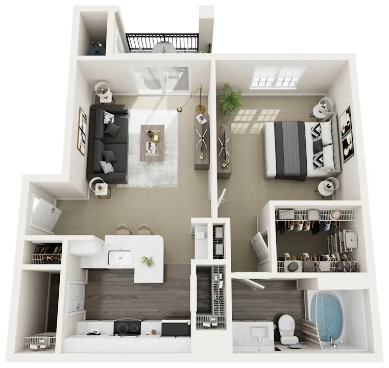
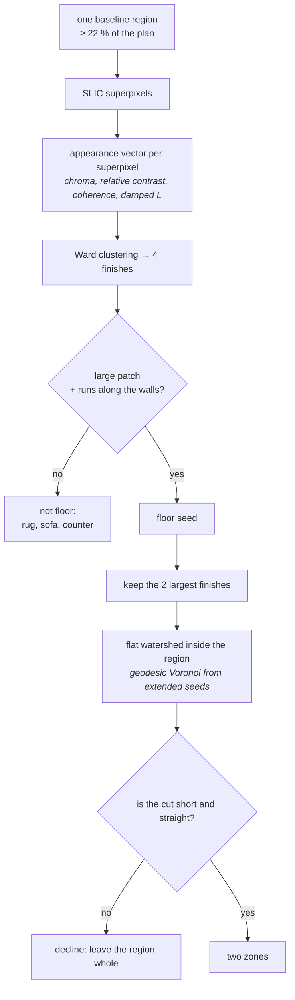
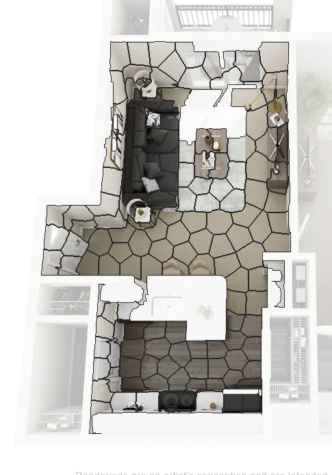
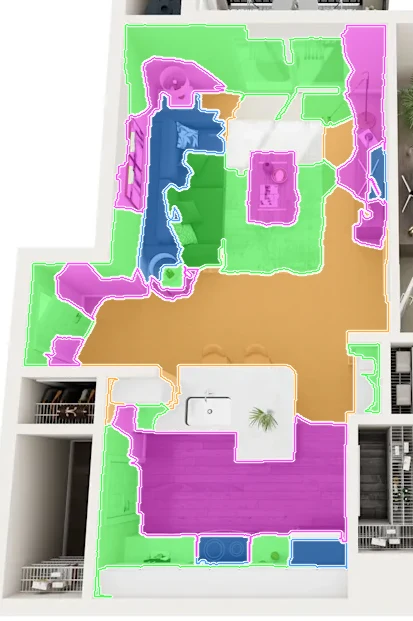
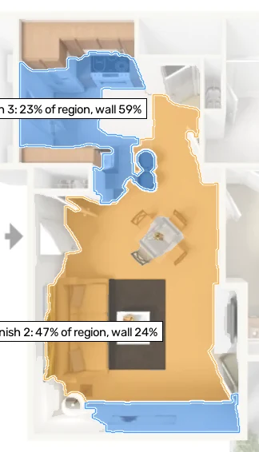
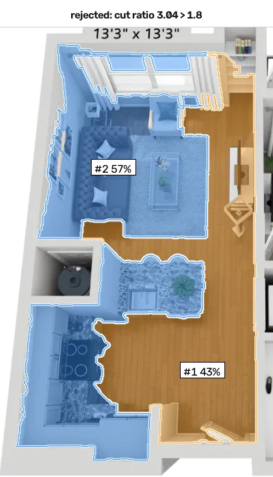
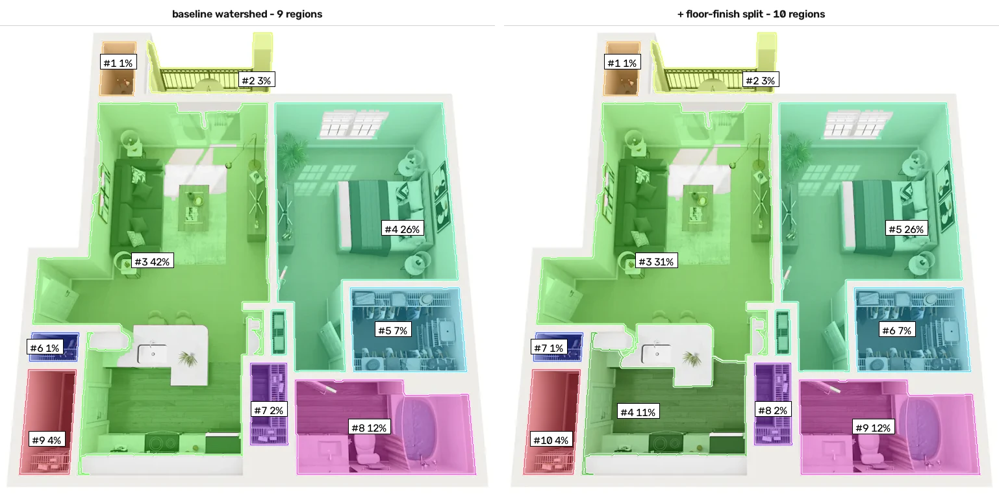
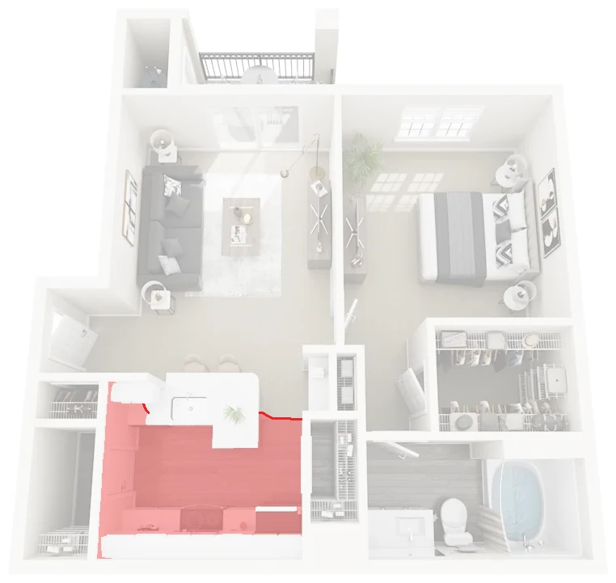
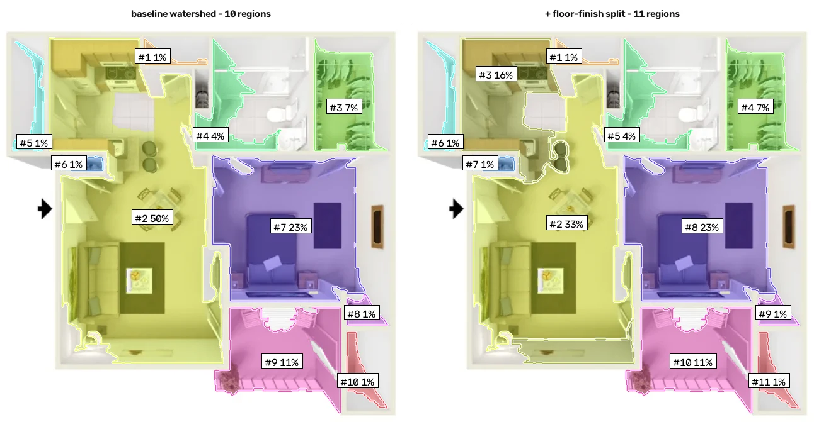
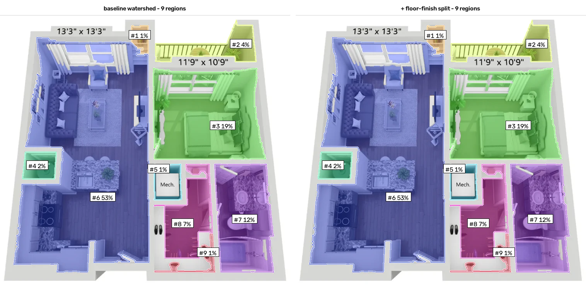

# Splitting open-plan areas by floor finish, offline

**What it adds:** a purely local, network-free replacement for the part of
step 10 that *cuts* an open-plan region ([root ALGORITHM.md, step 10](../../ALGORITHM.md#step-10-the-semantic-layer---semantics)).
The production pipeline can only split a kitchen from a living room by asking a
vision-language model for anchor points. This approach asks the floor instead:
where the material changes, the function usually changes too.

It sits **after** the baseline, consumes its regions, and touches nothing else.

**Result on the three samples in `data/`:**

| Render | Baseline | This approach | Decision on the open-plan region | Pixels kept |
|---|---|---|---|---|
| limestone ranch | 9 regions | **10** | split 42.2 % → 31.4 % + 10.9 % | 89 % |
| highlandlux (beige) | 10 regions | **11** | split 49.8 % → 33.5 % + 16.3 % | 84 % |
| heritage towers | 9 regions | **9** | declined — the cut wrapped the furniture | 100 % |

Two of the three renders get a plausible kitchen/living boundary with no API
call. The third is correctly left alone, and that is the part that took the
most work: the naive version happily cut bedrooms into "bed" and "floor".

---

## Contents

1. [The gap this fills](#1-the-gap-this-fills)
2. [The idea](#2-the-idea)
3. [Step by step](#3-step-by-step)
4. [The two guards](#4-the-two-guards)
5. [Applied to the three renders](#5-applied-to-the-three-renders)
6. [Against the committed vision-language run](#6-against-the-committed-vision-language-run)
7. [What improved, what got worse](#7-what-improved-what-got-worse)
8. [Limitations](#8-limitations)
9. [Regenerating the assets](#9-regenerating-the-assets)

---

## 1. The gap this fills

Every sample in this repository has one region that swallows a third to a half
of the flat: 42 % on `limestone ranch`, 50 % on `highlandlux`, 53 % on
`heritage towers`. It is the kitchen, the dining area and the living room with
no wall between them. The README calls it "the largest single error in all
three samples", and the shipped answer is `--semantics`: send the render to
GPT-4o, get anchor points back, cut geodesic Voronoi cells around them.

That answer costs an API key, 3–5 s per image, and — measured in the root
document — is not reproducible between runs at `temperature=0`.

But the information is often right there in the render. Kitchens are tiled or
planked, living rooms are carpeted; the boundary between the two materials is
drawn in the image, sharp and straight, and it is usually where a floor plan
would put the room boundary as well.



*The 42 % region runs from the sofa at the top to the hob at the bottom. Light
floor above, dark plank below, and the change happens on a straight line just
south of the island.*

## 2. The idea



Three decisions carry the method, and each was forced by a failure:

- **superpixels, not pixels** — a photoreal floor is noisy, and clustering raw
  pixels produces confetti. SLIC gives ~100–170 regions per open-plan area,
  each already respecting the material edges.
- **an illumination-damped feature vector** — the first version clustered on
  CIELAB alone and cut the sunlit half of a living room away from its shaded
  half. In the sample, the sunlit floor is 46 L-units away from the same floor
  in shade, while the wood and the carpet are 51 apart: *lightness alone cannot
  tell a material change from a sunbeam*.
- **"is it floor?" before "is it different?"** — the strongest appearance
  boundary in a living room is the sofa, not the flooring.

## 3. Step by step

Code: [`approach.py`](approach.py). Defaults:
`FinishSplitConfig(min_region_frac=0.22, superpixel_px=900, compactness=12, n_finishes=4, max_zones=2, max_cut_ratio=1.8)`.

### 3.1 Over-segment the region

`slic(..., mask=region, compactness=12, n_segments=area/900)` — 138, 108 and
169 superpixels on the three candidate regions.



### 3.2 Describe each superpixel

Five numbers, standardised over the region and then weighted:

| Feature | Weight | Why |
|---|---|---|
| `L` (median lightness) | 0.3 | carries the material, but also the lighting — damped, not dropped |
| `a`, `b` (median chroma) | 1.0 | warm plank vs neutral tile vs beige carpet |
| mean \|∇L\| / mean `L` | 1.0 | texture energy, **divided by brightness** so it is invariant to a multiplicative change in illumination |
| structure-tensor coherence | 0.5 | plank flooring has one dominant orientation; carpet has none |

The normalised contrast is what makes the sunbeam harmless: brightening a
surface scales its gradients by the same factor, and the ratio does not move.



*Four Ward clusters. Orange is the light floor — note that it keeps the sunlit
strip near the windows, which lightness-only clustering split off. Magenta is
the plank floor, green the white furniture and counters, blue the dark sofa.*

### 3.3 Decide which clusters are floor

A cluster becomes a seed through one of its connected patches when the patch is

- **large** — at least 6 % of the region, and
- **wall-bound** — at least 15 % of its own outline runs along the barrier.

The second test is what rejects furniture. A floor finish reaches the walls all
around its zone; a rug touches nothing, a sofa touches one wall over a short
stretch.



*`highlandlux`: the white kitchen tile (23 % of the region, 59 % of its outline
against a wall) and the beige living floor (47 %, 24 %). Both accepted.*

Only the two largest surviving finishes are kept (`max_zones=2`). The third
cluster, on all three renders, is a lighting artefact or a furniture group.

### 3.4 Grow the seeds

```python
watershed(np.zeros(region.shape, np.float32), markers=seeds, mask=region)
```

Flat terrain, so the watershed degenerates into geodesic Voronoi cells: every
pixel joins the nearest seed, measured *inside* the region. Because the seeds
are extended patches rather than single points, the boundary lands on the
material edge instead of halfway between two guessed anchors. Zones under 18 %
of the region are merged back into their largest neighbour.

## 4. The two guards

Without them the method is unusable. Run with the guards disabled
(`--min-region-frac 0.12 --max-cut-ratio 99`), every region above 12 % of the
plan gets cut:

| Render | Region | Share of plan | Proposed zones | Cut ratio | Verdict at defaults |
|---|---|---|---|---|---|
| limestone ranch | #3 | 31 % | 74 / 26 | **0.22** | split — kitchen plank vs living floor |
| limestone ranch | #4 | 20 % | 54 / 44 | 2.06 | rejected by the cut-shape guard — bedroom, cut wraps the bed |
| highlandlux | #2 | 32 % | 67 / 33 | **1.53** | split — living/dining vs kitchen tile |
| highlandlux | #7 | 15 % | 69 / 31 | 1.63 | rejected by the size guard — bedroom |
| heritage towers | #3 | 13 % | 38 / 62 | 1.02 | rejected by the size guard |
| heritage towers | #6 | 38 % | 43 / 56 | 3.04 | rejected by the cut-shape guard — one plank floor, cut wraps the furniture |

**The size guard** (`min_region_frac = 0.22`). On these renders every genuine
open-plan area covers 31–38 % of the footprint and the largest single room
stops at 20 %, so the threshold sits between the two populations. It is fitted
on three images and the 20 % bedroom is uncomfortably close to the line — which
is why the second guard matters.

**The cut-shape guard** (`max_cut_ratio = 1.8`). Measure the length of the
proposed cut in units of `sqrt(region area)`
([`research.common.cut_ratio`](../common.py)). A straight cut across a space
scores around 1, because its length is roughly the width of the space. A cut
that goes around an object has to travel out and back, and scores 2 and up:



*What the method wanted to do on `heritage towers`: orange is the plank floor,
blue is rug + sofa + kitchen counters. There is only one flooring material in
this region, so the strongest appearance boundary available is the furniture,
and the cut wraps it — ratio 3.04, rejected.*

Note what each guard catches: neither is sufficient alone. The size guard
rejects the two bedrooms whose cut looks respectable (1.63, 1.02); the
cut-shape guard rejects the two large regions that pass on size (2.06, 3.04).

## 5. Applied to the three renders

### limestone ranch — the clean case



The 42.2 % region becomes 31.4 % (light floor: living, entry and the strip in
front of the closets) and 10.9 % (plank floor: kitchen and the hall in front of
it). Cut ratio 0.22 — the shortest cut in the whole study, because the two
materials meet on a straight line across the narrowest part of the space.



*Red: the pixels that leave the old region. Blue: baseline boundaries; red
lines: the new ones. Everything outside the open-plan region is untouched.*

The boundary follows the material change, so it runs *south* of the kitchen
island — the island itself ends up with the living zone. A floor plan would
probably draw the line north of it. This is the intrinsic limit of the cue:
it finds where the flooring changes, which is close to, but not identical
with, where the function changes.

### highlandlux — right answer, ragged boundary



The 49.8 % region becomes 33.5 % (beige living and dining) and 16.3 % (white
tiled kitchen). The tile zone also claims a strip along the bottom wall, where
the beige floor is bright enough under direct light to cluster with the tile —
visible as the thin blue band at the bottom of the seed figure above. Cut ratio
1.53: higher than `limestone ranch` because the kitchen is an L and the cut has
to follow it.

### heritage towers — correctly declined



Identical to the baseline, by design. The living room, the hall and the kitchen
of this flat are laid with the *same* dark plank floor, so there is no material
boundary to find, and the method says so rather than inventing one. The
rejected proposal is the figure in [§4](#4-the-two-guards).

This is the case where the vision-language stage is genuinely irreplaceable:
only knowing that a hob means kitchen can divide this space.

## 6. Against the committed vision-language run

`output/semantic/*.json` holds a GPT-4o run of the same three images, so the
two approaches can be compared on the same regions. Shares are of the total
room area, as everywhere in this repository.

| Render | Baseline region | This approach | `--semantics` (GPT-4o) |
|---|---|---|---|
| limestone ranch | 42.2 % | 31.4 % + 10.9 % | living room 23.4 % + kitchen 19.1 % |
| highlandlux | 49.8 % | 33.5 % + 16.3 % | dining room 32.3 % + living room 17.5 % |
| heritage towers | 53.3 % | declined | not split either — named *entry* |

Three observations:

- **They cut different things.** On `highlandlux` the model separated *dining*
  from *living* — both on the same beige carpet — and gave the name *kitchen*
  to a 0.7 % region elsewhere. This approach separated the tiled kitchen from
  everything else. The model is reasoning about furniture; the method here is
  reasoning about materials. Neither is the other's approximation.
- **The model is not obviously better where both fire.** On `limestone ranch`
  its boundary is a straight Voronoi line between two guessed anchor points,
  which the root document already flags as "not the real edge of the floor
  finish". The finish boundary *is* the real edge — of the flooring, at least.
- **On the hardest region both fail the same way.** Neither splits the
  53 % open plan on `heritage towers`; the model only mislabels it.

What the model gives that this cannot: names. This approach produces two
anonymous zones. A plausible combination is to use the finish boundary as the
geometry and the model — or a small furniture detector — only for the labels.

## 7. What improved, what got worse

**Improved**

- The open-plan region is split on 2 of 3 renders **with no API key, no
  network, no weights**, in under a second.
- It is deterministic: SLIC, Ward linkage and the watershed have no random
  component here, so the same image gives the same cut every time. The shipped
  VLM path does not (documented in the root README).
- The boundary is placed on visible evidence — a material edge — not on a line
  between two coordinates a model guessed.
- It refuses to answer when the evidence is absent, which is the behaviour that
  makes it safe to run by default.

**Got worse / new risks**

- **Cuts on material, reports as function.** The kitchen island on
  `limestone ranch` ends up on the living side. Where a flat has continuous
  flooring under a functional boundary, the cut is simply wrong or absent.
- **Two thresholds fitted on three images.** `min_region_frac = 0.22` and
  `max_cut_ratio = 1.8` separate the six candidate regions cleanly, but with
  margins of 0.02 and 0.26 respectively. A fourth render could easily land
  between them.
- **A bright floor can pass for tile** (the bottom strip on `highlandlux`),
  so the zone boundary is ragged where the lighting is strong.
- It costs 0.4–1.0 s per image on top of the baseline's 0.2–0.6 s, which is
  2–3× the geometric pipeline, almost all of it in SLIC and in the per
  superpixel statistics.
- Zones are unnamed, and the id numbering of the whole plan shifts when a
  region is split — the same caveat the semantic stage carries.

## 8. Limitations

- Three renders, six candidate regions, no ground truth. Every number here is
  an observation, not a measurement against an annotation.
- Only one split per region (`max_zones = 2`). A kitchen + dining + living with
  three materials would come back as two zones.
- The method inherits every upstream error: it can only cut regions the
  baseline produced, and on `highlandlux` those regions are already dirty.
- The wall-contact test needs the barrier mask to be reasonable. On a render
  where walls are badly detected, "runs along a wall" stops meaning anything.

**Next steps, in the order I would try them**

1. Replace the two hand-set guards with one test on the *evidence*: how much of
   the proposed cut coincides with a strong, straight appearance edge in the
   image. That subsumes both guards and has a single threshold.
2. Snap the cut to the dominant plan directions. The material edge is straight
   in the render but the Voronoi boundary wobbles around furniture; projecting
   it onto the nearest axis-aligned line would clean up the polygons.
3. Detect the obvious kitchen fixtures (hob, sink, cabinet run) with a small
   template or colour model and use them to *name* the zone the finish split
   already found — the cheap half of what the VLM does.
4. Run the whole thing over a few hundred renders and check how often the
   guards fire, which is the only way to know whether 0.22 and 1.8 mean
   anything outside these three images.

## 9. Regenerating the assets

```bash
uv sync                                                      # once
uv run python research/superpixel-finish-split/run.py        # all three renders
uv run python research/superpixel-finish-split/run.py --image limestone

# the guard inventory in section 4
uv run python research/superpixel-finish-split/run.py \
    --min-region-frac 0.12 --max-cut-ratio 99 --no-assets
```

Every figure in this document and `assets/metrics.json` come from the first
command; the run prints its summary table as markdown. Nothing outside
`research/superpixel-finish-split/assets/` is written.
